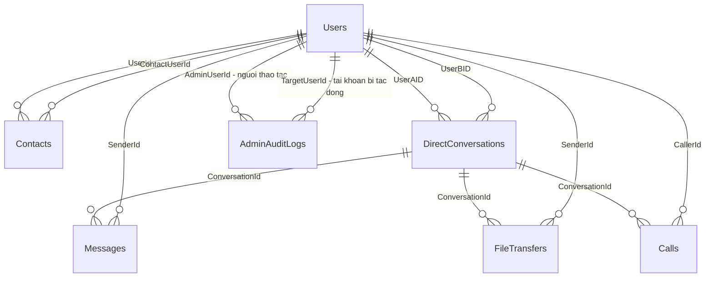

# PBL4 — Thiết kế database

**Phạm vi:** Chat, gọi thoại và truyền file 1–1 theo mô hình P2P kết hợp server

## 1. Tổng quan

| STT | Bảng | Mục đích |
|---|---|---|
| 1 | `Users` | Tài khoản, vai trò User/Admin, trạng thái khóa |
| 2 | `Contacts` | Danh bạ riêng của từng tài khoản |
| 3 | `DirectConversations` | Cuộc trò chuyện của một cặp người |
| 4 | `Messages` | Nội dung text và xác nhận đã nhận/đã đọc |
| 5 | `FileTransfers` | Metadata, checksum và kết quả truyền file |
| 6 | `Calls` | Metadata và kết quả cuộc gọi thoại |
| 7 | `AdminAuditLogs` | Nhật ký thao tác khóa/mở khóa tài khoản |

Admin là một tài khoản trong `Users` có `Role = 'Admin'`. Với hai vai trò cố định, dùng trực tiếp cột `Role`; chưa cần bảng `Admins`, `Roles` hay `Permissions` riêng.

## 2. Quyết định về phạm vi

### 2.1. Lưu text, file và âm thanh

- Server lưu bản sao **mọi tin nhắn text** để hỗ trợ lịch sử và giao lại tin khi người nhận offline.
- Client đăng ký tin với server trước, sau đó ưu tiên gửi realtime qua WebRTC DataChannel. Cách này phụ thuộc server khi bắt đầu gửi text.
- Nếu chỉ lưu tin offline, server sẽ thiếu lịch sử của các tin đã đi hoàn toàn qua P2P; bản thiết kế này chọn lưu đầy đủ text.
- Bytes file và âm thanh truyền qua WebRTC, có thể qua TURN khi cần relay. SQL chỉ giữ metadata và kết quả.
- Không lưu file/chunk/audio, SDP, ICE candidate hoặc tiến độ truyền liên tục vào các bảng nghiệp vụ.
- Server lưu được nội dung text nên bản thiết kế này chưa cung cấp mã hóa đầu cuối cho bản sao text trên server.

### 2.2. Danh bạ và trạng thái online

- `Contacts` là danh bạ **một chiều**: A thêm B không tự tạo dòng B thêm A.
- Người dùng có thể trò chuyện mà chưa thêm nhau vào danh bạ.
- Mỗi cặp người có tối đa một cuộc trò chuyện, được tạo khi bắt đầu trao đổi.
- Online/offline được xác định từ tập kết nối SignalR đang hoạt động trong bộ nhớ server. `LastSeenAt` chỉ là mốc tham khảo.
- ACK đã nhận/đã đọc áp dụng theo tài khoản; đồng bộ đầy đủ cho từng thiết bị nằm ngoài phạm vi hiện tại.

### 2.3. Phạm vi Admin và Log

Admin được xem danh sách tài khoản, xem thống kê tổng hợp, khóa/mở khóa tài khoản `User` và xem nhật ký quản trị.

Trong phiên bản này:

- Các thao tác khóa/mở chỉ tác động đến tài khoản có `Role = 'User'`.
- Admin không tự khóa mình hoặc khóa Admin khác; không có chức năng cấp/thu hồi vai trò Admin trong giao diện.
- Admin sử dụng chat/file/call theo cùng quy tắc thành viên như User. Vai trò Admin không cấp quyền đọc mọi cuộc trò chuyện riêng.
- `AdminAuditLogs` ghi **thay đổi trạng thái khóa đã thành công**. Lỗi đăng nhập, lỗi API và sự kiện kỹ thuật thuộc log ứng dụng riêng.
- Thống kê tổng hợp được tính từ các bảng hiện có, không cần thêm bảng thống kê cho MVP.

## 3. Sơ đồ quan hệ

`AdminUserId` và `TargetUserId` đều tham chiếu `Users.Id`, nhưng mang hai ý nghĩa khác nhau. Một người có thể xuất hiện trong nhiều dòng nhật ký.

## 4. Quy ước chung

- **PK:** khóa chính. **FK:** khóa ngoại. **UNIQUE:** giá trị hoặc bộ giá trị không được trùng.
- `IDENTITY(1,1)`: ID số nguyên do database tự tăng; client không tự cấp các ID này.
- Tất cả cột mặc định là `NOT NULL`, trừ những cột ghi rõ **Có** trong cột NULL.
- Thời gian dùng `DATETIME2(3)` và quy ước UTC; server cấp thời gian. Kiểu này không tự lưu múi giờ.
- `ROWVERSION` là giá trị nhị phân 8 byte tự thay đổi khi cập nhật dòng, dùng kiểm soát xung đột; không phải ngày giờ.
- Các FK dùng `NO ACTION` khi xóa. Nghiệp vụ quản trị dùng khóa tài khoản, không xóa dây chuyền lịch sử.
- Nội dung hiển thị dùng `NVARCHAR` để lưu tiếng Việt. Chuỗi trạng thái/vai trò dùng `VARCHAR` và quy ước phân biệt hoa/thường, không có khoảng trắng thừa.
- Backend kiểm tra độ dài, nội dung rỗng và các quy tắc nghiệp vụ trước khi ghi; DB bổ sung `NOT NULL`, `CHECK`, `UNIQUE`, FK và trigger thích hợp.

## 5. Chi tiết các bảng

### 5.1. Users — Tài khoản và vai trò

| Cột | Kiểu dữ liệu | NULL | Khóa / mặc định | Ý nghĩa |
|---|---|---|---|---|
| `Id` | `INT IDENTITY(1,1)` | Không | PK | ID tài khoản |
| `Username` | `NVARCHAR(32)` | Không | UNIQUE | Tên đăng nhập |
| `PasswordHash` | `NVARCHAR(512)` | Không | — | Hash mật khẩu do thư viện xác thực tạo |
| `DisplayName` | `NVARCHAR(100)` | Không | — | Tên hiển thị |
| `Role` | `VARCHAR(10)` | Không | Mặc định `'User'` | Vai trò `'User'` hoặc `'Admin'` |
| `IsDisabled` | `BIT` | Không | Mặc định `0` | `0`: hoạt động; `1`: bị khóa |
| `CreatedAt` | `DATETIME2(3)` | Không | `SYSUTCDATETIME()` | Thời điểm tạo tài khoản |
| `LastSeenAt` | `DATETIME2(3)` | Có | — | Lần cuối hoạt động được server ghi nhận |
| `RowVersion` | `ROWVERSION` | Không | DB tự cấp | Kiểm soát cập nhật đồng thời |

**Ràng buộc và nghiệp vụ:**

- `Username` dài 3–32 ký tự, chỉ gồm `a-z`, `A-Z`, `0-9`, `_`, `.`. So sánh tên đăng nhập không phân biệt hoa/thường; ví dụ dùng collation `Latin1_General_100_CI_AS`.
- `DisplayName` và `PasswordHash` không được rỗng. Mật khẩu dùng thư viện như `PasswordHasher`; SHA-256 dùng cho file không phải cách hash mật khẩu của ứng dụng.
- `CHECK Role IN ('User', 'Admin')`, với so sánh phân biệt hoa/thường và kiểm tra không có khoảng trắng thừa.
- `LastSeenAt` nếu có phải lớn hơn hoặc bằng `CreatedAt`.
- API đăng ký tự gán `Role = 'User'`, `IsDisabled = 0`; API sửa hồ sơ chỉ nhận các trường cho phép và không cho sửa hai trường quản trị này.
- Admin đầu tiên được tạo bằng bước khởi tạo do người triển khai kiểm soát, dùng hash mật khẩu hợp lệ. Không đặt mật khẩu Admin mặc định trong tài liệu/repository.
- Khi thêm cột vào dữ liệu cũ sau này, các tài khoản hiện có mặc định là `User`; chỉ tài khoản được chọn rõ ràng mới được cấp Admin.

### 5.2. Contacts — Danh bạ một chiều

| Cột | Kiểu dữ liệu | NULL | Khóa / mặc định | Ý nghĩa |
|---|---|---|---|---|
| `UserId` | `INT` | Không | PK ghép, FK → Users | Chủ danh bạ |
| `ContactUserId` | `INT` | Không | PK ghép, FK → Users | Tài khoản được lưu |
| `Alias` | `NVARCHAR(100)` | Có | — | Tên gợi nhớ riêng |
| `CreatedAt` | `DATETIME2(3)` | Không | `SYSUTCDATETIME()` | Thời điểm thêm |

- PK là `(UserId, ContactUserId)`; `CHECK UserId <> ContactUserId`.
- `Alias` nếu có không được chỉ chứa khoảng trắng.
- Chủ danh bạ được thêm, xóa và đổi Alias của mình. Đây chưa phải quan hệ kết bạn có lời mời/chấp nhận.

### 5.3. DirectConversations — Cuộc trò chuyện 1–1

| Cột | Kiểu dữ liệu | NULL | Khóa / mặc định | Ý nghĩa |
|---|---|---|---|---|
| `Id` | `BIGINT IDENTITY(1,1)` | Không | PK | ID cuộc trò chuyện |
| `UserAID` | `INT` | Không | FK → Users | Thành viên có ID nhỏ hơn |
| `UserBID` | `INT` | Không | FK → Users | Thành viên có ID lớn hơn |
| `CreatedAt` | `DATETIME2(3)` | Không | `SYSUTCDATETIME()` | Thời điểm tạo |

- `CHECK UserAID < UserBID`: cấm tự nhắn và chuẩn hóa thứ tự cặp.
- `UNIQUE (UserAID, UserBID)`: tránh tạo trùng cuộc trò chuyện khi hai client cùng gửi yêu cầu.
- Hai thành viên giữ nguyên sau khi tạo; dự kiến dùng trigger chặn thay đổi cặp.
- Khi tạo đồng thời gặp lỗi trùng cặp, API đọc lại cuộc trò chuyện đã tồn tại.
- Người nhận tin/file hoặc người được gọi được suy ra là thành viên còn lại; không cần lưu thêm `ReceiverId`/`CalleeId` trong các bảng con.

### 5.4. Messages — Tin nhắn text

| ột | Kiểu dữ liệu | NULL | Khóa / mặc định | Ý nghĩa |
|---|---|---|---|---|
| `Id` | `BIGINT IDENTITY(1,1)` | Không | PK | ID tin nhắn do server cấp |
| `ClientMessageId` | `CUNIQUEIDENTIFIER` | Không | Thuộc UNIQUE | UUID tạo một lần ở client |
| `ConversationId` | `BIGINT` | Không | FK → DirectConversations | Cuộc trò chuyện |
| `SenderId` | `INT` | Không | FK → Users | Người gửi |
| `Content` | `NVARCHAR(4000)` | Không | — | Nội dung text |
| `CreatedAt` | `DATETIME2(3)` | Không | `SYSUTCDATETIME()` | Thời điểm server lưu |
| `DeliveredAt` | `DATETIME2(3)` | Có | — | Server tiếp nhận ACK đã nhận |
| `ReadAt` | `DATETIME2(3)` | Có | — | Server tiếp nhận ACK đã đọc |
| `RowVersion` | `ROWVERSION` | Không | DB tự cấp | Kiểm soát cập nhật đồng thời |

- `UNIQUE (SenderId, ClientMessageId)` chống sinh tin trùng khi retry hoặc đổi đường truyền.
- `SenderId` phải thuộc cuộc trò chuyện; dự kiến dùng trigger kiểm tra toàn bộ các dòng INSERT/UPDATE.
- `Content` không được rỗng hoặc toàn khoảng trắng. Một UUID đã đăng ký phải giữ nguyên người gửi, cuộc trò chuyện và nội dung ở API.
- `DeliveredAt >= CreatedAt` nếu đã có ACK. `ReadAt` chỉ có khi `DeliveredAt` có giá trị và `ReadAt >= DeliveredAt`.
- Trạng thái được suy ra: chưa có ACK → **đã lưu**; có `DeliveredAt` → **đã nhận**; có `ReadAt` → **đã đọc**.
- ACK chỉ do người nhận gửi; API chỉ cho tiến trạng thái, không làm lùi hoặc xóa mốc đã ghi khi nhận ACK lặp.
- MVP chưa có sửa/xóa text, trả lời trích dẫn, reaction hoặc tin nhắn nhóm.

### 5.5. FileTransfers — Phiên truyền file

| Cột | Kiểu dữ liệu | NULL | Khóa / mặc định | Ý nghĩa |
|---|---|---|---|---|
| `Id` | `BIGINT IDENTITY(1,1)` | Không | PK | ID phiên truyền |
| `ClientTransferId` | `UNIQUEIDENTIFIER` | Không | Thuộc UNIQUE | UUID yêu cầu truyền |
| `ConversationId` | `BIGINT` | Không | FK → DirectConversations | Cuộc trò chuyện |
| `SenderId` | `INT` | Không | FK → Users | Người gửi file |
| `FileName` | `NVARCHAR(255)` | Không | — | Tên file để hiển thị |
| `FileSizeBytes` | `BIGINT` | Không | — | Kích thước tính bằng byte |
| `Sha256` | `VARBINARY(32)` | Không | — | Checksum dự kiến, đúng 32 byte |
| `VerifiedSha256` | `VARBINARY(32)` | Có | — | Checksum người nhận báo khi thành công |
| `Status` | `VARCHAR(12)` | Không | Mặc định `'offered'` | Trạng thái phiên |
| `CreatedAt` | `DATETIME2(3)` | Không | `SYSUTCDATETIME()` | Thời điểm đề nghị |
| `AcceptedAt` | `DATETIME2(3)` | Có | — | Thời điểm chấp nhận |
| `FinishedAt` | `DATETIME2(3)` | Có | — | Thời điểm kết thúc |
| `RowVersion` | `ROWVERSION` | Không | DB tự cấp | Kiểm soát cập nhật đồng thời |

- `UNIQUE (SenderId, ClientTransferId)`; người gửi phải thuộc cuộc trò chuyện.
- `FileSizeBytes >= 0`, cho phép file rỗng. `FileName` không rỗng và không được tin như đường dẫn lưu file.
- SHA-256 lưu dạng bytes; API chuyển đổi nếu giao thức dùng chuỗi hex 64 ký tự.
- `VerifiedSha256` chỉ có giá trị khi `Status = 'completed'`, phải đúng 32 byte và bằng `Sha256`.
- Người nhận phải kiểm tra số byte, tính lại checksum và lưu file thành công trước khi xác nhận completed. DB chỉ kiểm tra giá trị được báo, không tự đọc file.

| Status | Ý nghĩa | Mốc thời gian bắt buộc |
|---|---|---|
| `offered` | Chờ người nhận quyết định | AcceptedAt và FinishedAt đều NULL |
| `accepted` | Đã chấp nhận | Có AcceptedAt, FinishedAt NULL |
| `transferring` | Đang truyền | Có AcceptedAt, FinishedAt NULL |
| `completed` | Truyền và kiểm tra thành công | Có AcceptedAt, FinishedAt và VerifiedSha256 |
| `rejected` | Người nhận từ chối | AcceptedAt NULL, có FinishedAt |
| `expired` | Hết hạn lời đề nghị chưa chấp nhận | AcceptedAt NULL, có FinishedAt |
| `cancelled` | Một bên hủy | Có FinishedAt; AcceptedAt tùy đã chấp nhận hay chưa |
| `failed` | Lỗi truyền hoặc mất kết nối quá hạn | Có FinishedAt; AcceptedAt tùy thời điểm lỗi |

Các mốc nếu có phải theo thứ tự `CreatedAt <= AcceptedAt <= FinishedAt`; khi chưa có AcceptedAt thì FinishedAt vẫn phải từ CreatedAt trở đi. Phiên đã chấp nhận bị timeout dùng `failed`. Gửi lại sau khi phiên kết thúc tạo UUID mới.

### 5.6. Calls — Lịch sử gọi thoại

| Cột | Kiểu dữ liệu | NULL | Khóa / mặc định | Ý nghĩa |
|---|---|---|---|---|
| `Id` | `BIGINT IDENTITY(1,1)` | Không | PK | ID cuộc gọi |
| `ClientCallId` | `UNIQUEIDENTIFIER` | Không | Thuộc UNIQUE | UUID yêu cầu gọi |
| `ConversationId` | `BIGINT` | Không | FK → DirectConversations | Cuộc trò chuyện |
| `CallerId` | `INT` | Không | FK → Users | Người gọi |
| `Status` | `VARCHAR(12)` | Không | Mặc định `'ringing'` | Trạng thái cuộc gọi |
| `CreatedAt` | `DATETIME2(3)` | Không | `SYSUTCDATETIME()` | Thời điểm bắt đầu gọi |
| `AnsweredAt` | `DATETIME2(3)` | Có | — | Thời điểm chấp nhận |
| `EndedAt` | `DATETIME2(3)` | Có | — | Thời điểm kết thúc |
| `RowVersion` | `ROWVERSION` | Không | DB tự cấp | Kiểm soát cập nhật đồng thời |

- `UNIQUE (CallerId, ClientCallId)`; người gọi phải thuộc cuộc trò chuyện.
- Trạng thái: `ringing`, `active`, `completed`, `rejected`, `cancelled`, `missed`, `failed`.
- `ringing`: AnsweredAt/EndedAt đều NULL. `active`: có AnsweredAt, EndedAt NULL.
- `completed`: có cả AnsweredAt và EndedAt. `rejected`/`cancelled`/`missed`: AnsweredAt NULL, có EndedAt.
- `failed`: có EndedAt; AnsweredAt có hoặc không tùy cuộc gọi đã được trả lời chưa.
- Các mốc nếu có phải theo thứ tự `CreatedAt <= AnsweredAt <= EndedAt`; khi chưa trả lời thì EndedAt vẫn phải từ CreatedAt trở đi.
- Thời lượng phiên đã trả lời tính từ AnsweredAt đến EndedAt; đây là thời gian theo signaling, không phải số giây audio đo được.

### 5.7. AdminAuditLogs — Nhật ký quản trị

| Cột | Kiểu dữ liệu | NULL | Khóa / mặc định | Ý nghĩa |
|---|---|---|---|---|
| `Id` | `BIGINT IDENTITY(1,1)` | Không | PK | ID nhật ký |
| `RequestId` | `UNIQUEIDENTIFIER` | Không | Thuộc UNIQUE | UUID thao tác quản trị, giữ nguyên khi retry |
| `AdminUserId` | `INT` | Không | FK → Users | Admin đã thực hiện |
| `TargetUserId` | `INT` | Không | FK → Users | Tài khoản bị tác động |
| `Action` | `VARCHAR(20)` | Không | — | `'DisableUser'` hoặc `'EnableUser'` |
| `OldIsDisabled` | `BIT` | Không | — | Trạng thái trước thao tác |
| `NewIsDisabled` | `BIT` | Không | — | Trạng thái sau thao tác |
| `Reason` | `NVARCHAR(500)` | Không | — | Lý do khóa hoặc mở khóa |
| `CreatedAt` | `DATETIME2(3)` | Không | `SYSUTCDATETIME()` | Thời điểm server ghi nhận thao tác |

**Ràng buộc dữ liệu:**

- `UNIQUE (AdminUserId, RequestId)` chống thực hiện lại thao tác khi mất phản hồi và client gửi lại.
- `CHECK AdminUserId <> TargetUserId`.
- Action chỉ nhận hai giá trị đã định nghĩa, phân biệt hoa/thường và không có khoảng trắng thừa.
- `DisableUser` tương ứng `OldIsDisabled = 0`, `NewIsDisabled = 1`.
- `EnableUser` tương ứng `OldIsDisabled = 1`, `NewIsDisabled = 0`.
- Reason bắt buộc, không chỉ chứa khoảng trắng. Thời gian và trạng thái trước/sau do server cấp từ dữ liệu thực tế.

**Quy tắc ghi nhật ký:**

- FK `AdminUserId` chỉ xác nhận tài khoản tồn tại. Backend phải xác nhận người thao tác đang có Role Admin và không bị khóa tại thời điểm thực hiện.
- Tài khoản đích phải có Role User. Sau này thay đổi vai trò một tài khoản không được làm mất các log lịch sử của tài khoản đó.
- Log được server thêm trong cùng transaction với cập nhật `Users.IsDisabled`; nếu một bước thất bại, cả hai phải rollback.
- Nhật ký chỉ được thêm qua luồng quản trị. Người dùng không có endpoint tự tạo/sửa/xóa log; quyền DB của ứng dụng cũng cần hạn chế UPDATE/DELETE trên bảng log.
- Tính chỉ-ghi-thêm ở ứng dụng không đồng nghĩa chống sửa được bởi người có toàn quyền quản trị SQL Server.
- Với RequestId mới, khóa tài khoản vốn đã khóa hoặc mở tài khoản vốn đang hoạt động trả lỗi xung đột trạng thái (`409`) kèm trạng thái hiện tại và không tạo log thay đổi. Client dừng retry yêu cầu này; quyết định thao tác mới sau đó dùng RequestId mới.
- Khóa chống trùng bảo vệ các thay đổi đã commit và có log; bảng này không lưu kết quả của mọi yêu cầu bị từ chối hoặc không làm thay đổi trạng thái.
- Không lưu mật khẩu, token hay nội dung chat vào Reason hoặc nhật ký quản trị.

**Ví dụ minh họa:**

| Id | AdminUserId | TargetUserId | Action | OldIsDisabled | NewIsDisabled | Reason |
|---|---|---|---|---|---|---|
| 1 | 1 | 3 | DisableUser | 0 | 1 | Gửi tin rác liên tục |
| 2 | 1 | 3 | EnableUser | 1 | 0 | Đã xác minh và cho phép hoạt động lại |

Hai dòng là hai sự kiện lịch sử, nên được giữ nguyên. Trạng thái hiện tại của tài khoản 3 nằm trong `Users.IsDisabled`.

## 6. Luồng nghiệp vụ chính

### 6.1. Đăng ký và phân quyền

1. Server kiểm tra Username và mật khẩu, tạo PasswordHash bằng thư viện.
2. Tạo tài khoản với Role User, IsDisabled = 0; không nhận Role từ form đăng ký.
3. Khi đăng nhập hoặc gọi API cần xác thực, kiểm tra trạng thái tài khoản.
4. Endpoint quản trị yêu cầu Admin. Không chỉ ẩn nút trên giao diện: backend phải kiểm tra quyền thực tế.
5. Các quyết định khóa/mở đọc trạng thái và vai trò hiện tại từ DB; tránh chỉ tin role hoặc trạng thái trong JWT đã cấp từ trước.

### 6.2. Admin khóa/mở khóa tài khoản

1. Client tạo RequestId một lần cho thao tác, gửi tài khoản đích, Action, Reason và RowVersion đã đọc của tài khoản đích.
2. Backend lấy AdminUserId từ danh tính đăng nhập. Trong transaction, kiểm tra và bảo vệ trạng thái của người thao tác và tài khoản đích trước các cập nhật cạnh tranh.
3. Nếu đã có log với `(AdminUserId, RequestId)`, so sánh tài khoản đích, Action và Reason. Giống nhau thì trả kết quả thao tác đã ghi; khác nhau thì từ chối sử dụng lại RequestId. Không thực hiện lại thao tác cũ.
4. Với yêu cầu mới, xác nhận Admin đang hoạt động, tài khoản đích là User và trạng thái được yêu cầu có thay đổi thực tế.
5. Cập nhật IsDisabled với điều kiện RowVersion vẫn khớp và tài khoản đích vẫn có Role User. Chỉ tiếp tục nếu cập nhật đúng một dòng. Nếu đã có người cập nhật trước, rollback và yêu cầu đọc lại trạng thái.
6. Thêm AdminAuditLogs với trạng thái trước/sau vừa cập nhật rồi commit. Quy tắc UNIQUE chống request trùng cũng phải được xử lý an toàn khi hai retry đến đồng thời.
7. Trả kết quả cho Admin. Với thao tác khóa, server từ chối thao tác mới của tài khoản đích và yêu cầu ngắt các phiên SignalR liên quan.

Tài khoản đã bị khóa không được tiếp tục gọi API hoặc gửi signaling qua kết nối cũ; việc kiểm tra phải áp dụng cả cho các kết nối đã xác thực trước đó. Một kênh P2P đã thiết lập không tự bị cắt chỉ nhờ đổi cột DB: client cần xử lý thông báo khóa/đóng phiên. Server không bảo đảm chặn ngay bytes đang đi trực tiếp giữa hai client không tuân thủ.

### 6.3. Gửi text và xác nhận

1. Client tạo ClientMessageId và đăng ký nội dung với server.
2. Server lấy SenderId từ danh tính đăng nhập, kiểm tra quyền/thành viên và lưu tin.
3. Nếu UUID đã tồn tại, cùng payload thì trả tin cũ; payload khác thì từ chối.
4. Client gửi tin cùng ID qua DataChannel. Server có thể giao lại qua kết nối ứng dụng khi người nhận offline trước đó hoặc P2P lỗi.
5. Người nhận chống trùng theo ID, lưu tin rồi gửi ACK; server ghi DeliveredAt bằng đồng hồ server.
6. Khi đọc, người nhận gửi ACK đọc; server ghi ReadAt và bổ sung DeliveredAt nếu ACK đọc đến trước ACK nhận.
7. Tin được giữ để đọc lịch sử. Gửi SignalR/WebRTC thành công chưa có nghĩa người nhận đã nhận hoặc đọc.

### 6.4. Trạng thái file và cuộc gọi

| Đối tượng | Các chuyển trạng thái được API cho phép |
|---|---|
| File `offered` | accepted, rejected, cancelled, failed, expired |
| File `accepted` | transferring, cancelled, failed |
| File `transferring` | completed, cancelled, failed |
| Call `ringing` | active, rejected, cancelled, missed, failed |
| Call `active` | completed, failed |

Trạng thái kết thúc không quay lại đang chạy; retry cùng kết quả có thể trả kết quả cũ. CHECK kiểm tra tổ hợp dữ liệu của một dòng; API kiểm tra chuyển trạng thái từ giá trị trước sang giá trị sau. Server cần tác vụ timeout cho lời đề nghị/cuộc gọi treo.

## 7. Ma trận quyền

| Chức năng | User | Admin |
|---|---|---|
| Sửa hồ sơ của mình | Có | Có |
| Tìm tài khoản để bắt đầu trò chuyện | Có, thông tin công khai cơ bản | Có |
| Chat, gọi, gửi file | Trong cuộc trò chuyện của mình | Trong cuộc trò chuyện của mình |
| Xem lịch sử riêng | Chỉ cuộc trò chuyện của mình | Chỉ cuộc trò chuyện của mình |
| Quản lý danh bạ | Danh bạ của mình | Danh bạ của mình |
| Xem danh sách tài khoản kèm vai trò/trạng thái quản trị | Không | Có |
| Khóa/mở khóa tài khoản User | Không | Có, bắt buộc ghi log |
| Xem AdminAuditLogs và thống kê tổng hợp | Không | Có |
| Tự đổi Role hoặc quản lý vai trò Admin qua UI | Không | Không thuộc phiên bản này |
| Sửa/xóa nhật ký quản trị | Không | Không có chức năng này |

Các quyền sử dụng chỉ áp dụng khi tài khoản đang hoạt động. ACK nhận/đọc và chấp nhận/từ chối file/call thuộc người nhận; quyền Admin không thay thế vai trò người nhận trong các luồng đó.

## 8. Index đề xuất

| Bảng | Index / khóa | Phục vụ |
|---|---|---|
| Users | UNIQUE Username | Đăng nhập, tìm theo tên chính xác, chống trùng |
| Contacts | PK (UserId, ContactUserId); index ContactUserId | Danh bạ và tra quan hệ ngược |
| DirectConversations | UNIQUE (UserAID, UserBID); index (UserBID, Id) | Tìm cặp và liệt kê cuộc trò chuyện |
| Messages | UNIQUE (SenderId, ClientMessageId) | Chống gửi trùng |
| Messages | (ConversationId, CreatedAt DESC, Id DESC) | Phân trang lịch sử |
| Messages | (ConversationId, CreatedAt, Id), WHERE DeliveredAt IS NULL | Giao lại tin chưa được ACK |
| Messages | (ConversationId, SenderId), WHERE ReadAt IS NULL | Đếm tin chưa đọc |
| FileTransfers | UNIQUE (SenderId, ClientTransferId); (ConversationId, CreatedAt DESC, Id DESC) | Retry và lịch sử file |
| FileTransfers | (CreatedAt, Id), WHERE FinishedAt IS NULL | Tìm phiên cần xử lý timeout |
| Calls | UNIQUE (CallerId, ClientCallId); (ConversationId, CreatedAt DESC, Id DESC) | Retry và lịch sử gọi |
| Calls | (CreatedAt, Id), WHERE EndedAt IS NULL | Tìm cuộc gọi chưa kết thúc |
| AdminAuditLogs | UNIQUE (AdminUserId, RequestId) | Chống thực hiện lại thao tác |
| AdminAuditLogs | (TargetUserId, CreatedAt DESC, Id DESC) | Lịch sử khóa/mở của một tài khoản |
| AdminAuditLogs | (CreatedAt DESC, Id DESC), INCLUDE (AdminUserId, TargetUserId, Action) | Danh sách log gần nhất |

Với filtered index có `IS NULL`, đưa cả cột được lọc vào key hoặc INCLUDE. Phân trang lịch sử dùng cặp `(CreatedAt, Id)` để xử lý timestamp trùng nhau. Truy vấn pending phải chọn đúng người nhận, loại tin do chính họ gửi, và giao theo từng đợt có giới hạn.

Chưa cần thêm index chỉ trên Role hoặc IsDisabled cho lượng dữ liệu nhỏ; xem truy vấn thực tế và kế hoạch thực thi trước khi bổ sung.

## 9. Phân chia trách nhiệm khi triển khai

| Database bảo đảm bằng cấu trúc/ràng buộc | Backend và client phải thực hiện |
|---|---|
| ID tham chiếu tồn tại; cặp hội thoại và UUID không trùng | Xác thực và kiểm tra quyền ở từng API/SignalR |
| Vai trò, Action, Status nằm trong tập hợp cho phép | Ngăn tự cấp Admin; kiểm tra vai trò hiện tại của người quản trị |
| Tổ hợp thời gian/checksum/trạng thái nhất quán | Chuyển trạng thái đúng thứ tự và ACK chỉ tiến lên |
| Trigger kiểm tra người gửi/người gọi thuộc hội thoại; cặp thành viên bất biến | Gắn peer đúng danh tính và chống giả mạo sender/caller |
| UNIQUE RequestId và CHECK trước/sau của log | Cập nhật Users và ghi log trong cùng transaction |
| RowVersion tự đổi khi cập nhật | Dùng RowVersion trong điều kiện cập nhật, xử lý xung đột |
| FK và quyền ghi được cấu hình phù hợp | Bảo vệ log, lọc dữ liệu công khai và dữ liệu quản trị |

Các trigger và quyền DB nêu trên là yêu cầu của bản thiết kế để hiện thực sau. Bản Markdown này chưa tạo bảng, migration, trigger, tài khoản Admin hoặc dữ liệu log.

## 10. Các phần để phát triển sau

- Cấp/thu hồi quyền Admin, nhiều vai trò và phân quyền chi tiết: mở rộng thiết kế vai trò và Action của log khi có nhu cầu.
- Refresh token, thu hồi từng phiên đăng nhập và đồng bộ đa thiết bị: cần thêm mô hình phiên/biên nhận tương ứng.
- Kết bạn hai chiều, chặn người dùng, báo cáo vi phạm: bổ sung bảng khi nghiệp vụ được chốt.
- Group chat/group call: cần mô hình thành viên nhóm thay cho cặp cố định.
- File offline, pause/resume, tải lại file: cần lưu trữ và giao thức riêng ngoài metadata hiện tại.

**Thiết kế chốt trong tài liệu:** 7 bảng; Admin nằm trong Users; IsDisabled giữ trạng thái hiện tại; AdminAuditLogs giữ lịch sử khóa/mở; phần P2P tiếp tục phục vụ text realtime, file và âm thanh theo phạm vi đã nêu.

## 11. Tài liệu kỹ thuật tham khảo

- [SQL Server — CREATE TABLE và ràng buộc](https://learn.microsoft.com/en-us/sql/t-sql/statements/create-table-transact-sql?view=sql-server-ver17).
- [SQL Server — khóa chính, khóa ngoại và index](https://learn.microsoft.com/en-us/sql/relational-databases/tables/primary-and-foreign-key-constraints?view=sql-server-ver17).
- [SignalR — người dùng và nhiều kết nối](https://learn.microsoft.com/en-us/aspnet/core/signalr/groups?view=aspnetcore-10.0).
- [SQL Server — filtered index với điều kiện IS NULL](https://learn.microsoft.com/en-us/troubleshoot/sql/database-engine/performance/filtered-index-with-column-is-null).
