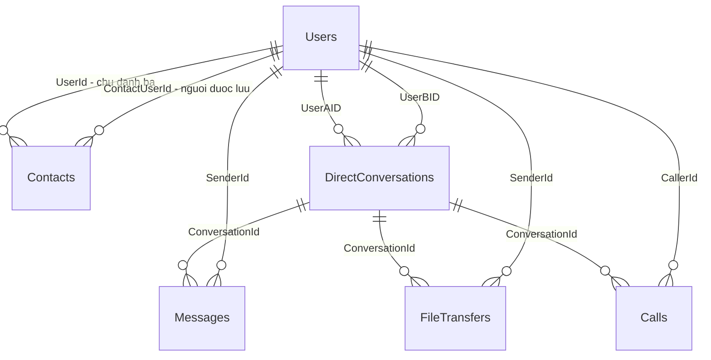

# Thiết kế database cho PBL4

## 1. Mục tiêu và nhận xét thiết kế ban đầu

Thiết kế này dùng SQL Server 2022 trở lên, phù hợp backend ASP.NET Core + EF Core.
Phạm vi là nhắn tin, truyền file và gọi thoại **1–1**, trên Web và Desktop.
README được cung cấp là tài liệu mô tả đề tài; các lựa chọn dưới đây là đề xuất triển khai mới.

Bốn bảng ban đầu đủ mô tả ý tưởng, nhưng chưa đủ quy tắc để xử lý mất mạng, gửi lại và dữ liệu không hợp lệ:

| Bảng ban đầu | Điểm tốt | Vấn đề cần bổ sung |
|---|---|---|
| Users | Tách tài khoản khỏi dữ liệu trao đổi | Username duy nhất, giới hạn độ dài, khóa ngoại và cách vô hiệu hóa tài khoản |
| Messages | Có người gửi, người nhận và nội dung | Chống gửi trùng; mốc đã nhận/đã đọc; quy tắc lưu lịch sử P2P |
| Contacts | Quan hệ đơn giản, dễ triển khai | Khóa ghép; cấm thêm chính mình; xác định danh bạ một chiều |
| FileTransfers | Không lưu bytes file vào DB | SHA-256; mốc chấp nhận/kết thúc; phân biệt thất bại, từ chối, hủy |

Hai bảng bổ sung là **DirectConversations** để gom lịch sử của một cặp người và **Calls** để lưu kết quả cuộc gọi.
Không cần thiết kế sẵn phòng nhóm, bảng chunk hay hệ thống đồng bộ từng thiết bị cho MVP.

## 2. Các quyết định phạm vi

### 2.1. Lưu bản sao mọi tin nhắn text trên server

Nếu chỉ lưu tin offline, server sẽ không biết nội dung các tin đã đi hoàn toàn qua P2P.
Khi đó tính năng lịch sử trên server không thể trả về toàn bộ cuộc trò chuyện.
Thiết kế này chọn **đăng ký và lưu text trên server trước, sau đó gửi realtime qua WebRTC DataChannel**.

Server vì vậy lưu nội dung text, metadata và hỗ trợ giao lại tin chưa được xác nhận.
P2P vẫn là đường truyền realtime ưu tiên giữa hai client; audio và bytes file không đi vào database.
Đây là lựa chọn phục vụ lịch sử và độ tin cậy, đồng thời làm tăng lưu lượng lưu trữ text trên server.
Nó phụ thuộc server khi bắt đầu gửi tin; gửi text hoàn toàn không có server không thuộc baseline này.

### 2.2. Danh bạ và cuộc trò chuyện

- Contacts là danh bạ **một chiều**: A thêm B không tự tạo dòng B thêm A.
- Chưa có yêu cầu kết bạn, phê duyệt lời mời hoặc chặn người dùng.
- Cho phép nhắn tin giữa hai tài khoản hợp lệ mà không bắt buộc có Contacts.
- Mỗi cặp người có tối đa một DirectConversations, được tạo khi bắt đầu trao đổi; cặp được lưu theo thứ tự ID tăng dần.
- SenderId/CallerId xác định người khởi tạo; người nhận là thành viên còn lại của cặp.
- Không lưu thêm ReceiverId/CalleeId trong các bảng con để tránh hai thông tin mâu thuẫn nhau.

### 2.3. Dữ liệu lâu dài và dữ liệu tạm thời

| Lưu trong SQL Server | Giữ trong bộ nhớ server/client |
|---|---|
| Tài khoản, danh bạ, cuộc trò chuyện | SignalR ConnectionId và tập kết nối đang hoạt động |
| Text và mốc đã nhận/đã đọc | SDP, ICE candidates, trạng thái thiết lập WebRTC |
| Metadata và kết quả truyền file | Bytes file, chunks, bộ đệm, tốc độ và tiến độ truyền |
| Metadata và kết quả gọi thoại | Audio, trạng thái microphone tức thời |

Online khi tài khoản còn ít nhất một kết nối đang hoạt động; không dùng một cột IsOnline làm nguồn sự thật.
LastSeenAt là thông tin tham khảo về lần cuối hoạt động, không chứng minh người đó đang online.

## 3. Sơ đồ quan hệ

Mỗi dòng bảng con thuộc đúng một cuộc trò chuyện và có đúng một người gửi/người gọi.
Khóa ngoại kiểm tra ID tồn tại; trigger bổ sung kiểm tra người khởi tạo thuộc cặp thành viên.
Trigger cũng không cho đổi cặp thành viên của một cuộc trò chuyện đã tạo.

## 4. Từ điển dữ liệu

Quy ước: PK là khóa chính; FK là khóa ngoại; `?` là có thể NULL.
Các mốc thời gian dùng datetime2(3) theo UTC. CreatedAt được cấp mặc định tại server.
`rowversion` là mã phiên bản nhị phân do SQL Server cấp, **không phải ngày giờ**.

### 4.1. Users

| Cột | Kiểu | Ý nghĩa |
|---|---|---|
| Id | int identity, PK | ID nội bộ của tài khoản |
| Username | nvarchar(32), UNIQUE | Tên đăng nhập, so sánh không phân biệt hoa/thường theo CI_AS |
| PasswordHash | nvarchar(512) | Chuỗi hash mật khẩu do thư viện xác thực tạo |
| DisplayName | nvarchar(100) | Tên hiển thị, có thể dùng tiếng Việt |
| CreatedAt | datetime2 | Thời điểm tạo tài khoản |
| LastSeenAt | datetime2? | Lần cuối hoạt động được server ghi nhận |
| IsDisabled | bit | Vô hiệu hóa đăng nhập và thao tác mới |

Username dài 3–32 ký tự, chỉ gồm `a–z`, `A–Z`, `0–9`, `_`, `.`; SQL và backend cùng kiểm tra quy tắc này.
CI_AS có nghĩa không phân biệt chữ hoa/thường, có phân biệt dấu; backend dùng cùng quy tắc trước khi tra cứu/đăng ký.
Dùng PasswordHasher hoặc hệ thống xác thực tương đương; không lưu plaintext hay tự dùng SHA-256 để hash mật khẩu.

### 4.2. Contacts

| Cột | Kiểu | Ý nghĩa |
|---|---|---|
| UserId | int, PK + FK Users | Chủ danh bạ |
| ContactUserId | int, PK + FK Users | Tài khoản được lưu |
| Alias | nvarchar(100)? | Tên gợi nhớ riêng do chủ danh bạ đặt |
| CreatedAt | datetime2 | Thời điểm thêm vào danh bạ |

PK ghép ngăn thêm cùng một người hai lần; CHECK cấm UserId = ContactUserId.
Chỉ chủ danh bạ được xem/sửa Alias và thêm/xóa dòng của mình.

### 4.3. DirectConversations

| Cột | Kiểu | Ý nghĩa |
|---|---|---|
| Id | bigint identity, PK | ID cuộc trò chuyện |
| UserAID | int, FK Users | ID nhỏ hơn của hai thành viên |
| UserBID | int, FK Users | ID lớn hơn của hai thành viên |
| CreatedAt | datetime2 | Thời điểm tạo cuộc trò chuyện |

CHECK UserAID < UserBID vừa cấm tự nhắn vừa chuẩn hóa thứ tự cặp.
UNIQUE (UserAID, UserBID) ngăn hai cuộc trò chuyện trùng nhau, kể cả khi hai client tạo đồng thời.
API thực hiện tìm hoặc tạo; khi gặp lỗi trùng cặp do cạnh tranh, đọc lại dòng đã được tạo.

### 4.4. Messages

| Cột | Kiểu | Ý nghĩa |
|---|---|---|
| Id | bigint identity, PK | ID bản ghi do server cấp |
| ClientMessageId | uniqueidentifier | UUID giữ nguyên qua các lần gửi lại |
| ConversationId | bigint, FK | Cuộc trò chuyện chứa tin |
| SenderId | int, FK Users | Người gửi, lấy từ tài khoản đã xác thực |
| Content | nvarchar(4000) | Nội dung text, backend từ chối nội dung rỗng |
| CreatedAt | datetime2 | Thời điểm server lưu tin |
| DeliveredAt | datetime2? | Người nhận xác nhận đã tiếp nhận và lưu vào lịch sử cục bộ |
| ReadAt | datetime2? | Người nhận xác nhận đã đọc |
| RowVersion | rowversion | Kiểm soát cập nhật đồng thời |

UNIQUE (SenderId, ClientMessageId) là khóa chống trùng cho thao tác gửi.
Không cần Status trùng lặp: ReadAt có giá trị là đã đọc; nếu chỉ DeliveredAt có giá trị là đã nhận; còn lại là chờ ACK.
ReadAt chỉ hợp lệ khi đã có DeliveredAt, và các mốc không đi trước CreatedAt.
API ghi thời gian tiếp nhận ACK bằng đồng hồ server; thời gian này có thể muộn hơn lúc peer thực sự nhận tin.

### 4.5. FileTransfers

| Cột | Kiểu | Ý nghĩa |
|---|---|---|
| Id | bigint identity, PK | ID phiên gửi file |
| ClientTransferId | uniqueidentifier | UUID giữ nguyên khi gửi lại yêu cầu tạo phiên |
| ConversationId | bigint, FK | Cuộc trò chuyện |
| SenderId | int, FK Users | Người gửi file |
| FileName | nvarchar(255) | Tên file để hiển thị, không phải đường dẫn được tin cậy |
| FileSizeBytes | bigint | Số bytes, không âm; cho phép file rỗng |
| Sha256 | varbinary(32) | SHA-256 dự kiến, phải đủ 32 bytes |
| VerifiedSha256 | varbinary(32)? | Checksum người nhận báo sau khi kiểm tra thành công |
| Status | varchar(12) | offered / accepted / transferring / completed / rejected / cancelled / failed / expired |
| CreatedAt | datetime2 | Thời điểm tạo lời đề nghị |
| AcceptedAt | datetime2? | Thời điểm người nhận chấp nhận |
| FinishedAt | datetime2? | Thời điểm kết thúc, kể cả khi không thành công |
| RowVersion | rowversion | Kiểm soát cập nhật đồng thời |

UNIQUE (SenderId, ClientTransferId) ngăn tạo trùng phiên do retry; gửi file lại sau thất bại dùng UUID mới.
Sha256 lưu bytes, không phải chuỗi hex 64 ký tự; API chuyển đổi nếu giao thức dùng hex.
VerifiedSha256 chỉ có giá trị ở completed và phải bằng Sha256; completed phải có xác nhận từ người nhận.
Ràng buộc này kiểm tra bản ghi nhất quán, không tự đọc file hay chứng minh client báo checksum trung thực.
Client phải kiểm tra kích thước, tính lại SHA-256 và lưu file xong trước khi báo completed.

### 4.6. Calls

| Cột | Kiểu | Ý nghĩa |
|---|---|---|
| Id | bigint identity, PK | ID cuộc gọi |
| ClientCallId | uniqueidentifier | UUID giữ nguyên khi gửi lại yêu cầu gọi |
| ConversationId | bigint, FK | Cuộc trò chuyện |
| CallerId | int, FK Users | Người bắt đầu gọi |
| Status | varchar(12) | ringing / active / completed / rejected / cancelled / missed / failed |
| CreatedAt | datetime2 | Thời điểm bắt đầu gọi |
| AnsweredAt | datetime2? | Thời điểm chấp nhận cuộc gọi |
| EndedAt | datetime2? | Thời điểm kết thúc, kể cả khi chưa được trả lời |
| RowVersion | rowversion | Kiểm soát cập nhật đồng thời |

UNIQUE (CallerId, ClientCallId) ngăn tạo trùng lần gọi do retry; gọi lại là UUID mới.
Thời lượng phiên đã trả lời tính từ AnsweredAt đến EndedAt, không cần lưu thêm Duration.
Đây là metadata theo sự kiện signaling; không phải số đo chính xác số giây audio đã truyền.

## 5. Luồng gửi text và ACK

1. Client tạo ClientMessageId một lần và giữ cùng nội dung/cùng người nhận khi retry.
2. Client gọi API; server lấy SenderId từ danh tính đăng nhập, kiểm tra thành viên và lưu Messages.
3. Nếu khóa chống trùng đã tồn tại, API so sánh conversation và nội dung: giống thì trả dòng cũ, khác thì từ chối.
4. Server trả Message Id; client gửi envelope chứa ID và nội dung qua DataChannel đã gắn đúng peer.
5. Nếu người nhận offline hoặc P2P lỗi, server dùng bản sao đã lưu để giao lại qua kết nối ứng dụng khi có thể.
6. Người nhận chống trùng theo ID, ghi vào lịch sử cục bộ rồi gửi ACK tới server; ACK mất thì được gửi lại.
7. Server ghi DeliveredAt nếu chưa có. Khi người dùng đọc tin, server ghi ReadAt và bổ sung DeliveredAt nếu cần.
8. Đọc lại lịch sử qua API theo ConversationId; server kiểm tra người gọi API thuộc cặp thành viên.

P2P và đường server có thể cùng giao một tin do mất ACK hoặc thay đổi kết nối.
Thiết kế chấp nhận việc giao nhiều lần và chống trùng ở hai đầu; không cam kết mạng chỉ giao đúng một lần.
Không đánh dấu delivered chỉ vì gọi hàm gửi SignalR/WebRTC thành công, cũng không xóa tin ngay sau khi gửi.
Text không sửa/xóa trong MVP; ConversationId, SenderId và payload của một ID đã đăng ký phải giữ nguyên tại API.
Yêu cầu tạo file/call cũng đối chiếu payload khi trùng khóa Client*Id; UUID cũ không được dùng để thay đổi phiên đã tạo.

## 6. Trạng thái và xử lý mất kết nối

| Đối tượng | Chuyển trạng thái hợp lệ ở API |
|---|---|
| Tin nhắn | Chờ ACK → đã nhận → đã đọc; ACK lặp không làm lùi trạng thái |
| File offered | accepted, rejected, cancelled, failed hoặc expired |
| File accepted | transferring, cancelled hoặc failed |
| File transferring | completed, cancelled hoặc failed |
| Cuộc gọi ringing | active, rejected, cancelled, missed hoặc failed |
| Cuộc gọi active | completed hoặc failed |

Các trạng thái kết thúc không quay lại đang chạy; yêu cầu lặp cùng kết quả có thể trả kết quả cũ.
expired dành cho đề nghị file hết hạn trước khi được chấp nhận; phiên đã chấp nhận nhưng mất kết nối quá hạn dùng failed.
AcceptedAt/AnsweredAt được ghi khi chấp nhận; FinishedAt/EndedAt được ghi ở mọi nhánh kết thúc.
Các mốc phải hợp lý theo thứ tự, và chỉ API cấp bằng thời gian UTC server.
CHECK trong SQL kiểm tra tổ hợp trạng thái/timestamp/checksum của **một bản ghi**.
CHECK không biết trạng thái trước đó; API phải kiểm soát chuyển trạng thái, quyền thao tác và receipt chỉ tiến lên.

Khi cập nhật, API dùng RowVersion đã đọc trong điều kiện UPDATE; không khớp thì đọc lại và xử lý xung đột.
Ví dụ người gọi hủy đúng lúc người nhận chấp nhận: chỉ một cập nhật được thắng, bên còn lại nhận trạng thái mới.
Server cần tác vụ timeout để kết thúc lời mời/call treo và xử lý phiên dang dở khi server khởi động lại.
Giá trị timeout là cấu hình ứng dụng; schema không tự lập lịch hoặc tự đoán mất kết nối.

## 7. Phân quyền và ranh giới trách nhiệm

| Thao tác | Người được phép |
|---|---|
| Tạo/sửa danh bạ | Chủ danh bạ |
| Xem lịch sử text/file/call | Một trong hai thành viên cuộc trò chuyện |
| Gửi text, đề nghị file hoặc bắt đầu gọi | Tài khoản đang đăng nhập; không nhận sender/caller tùy ý từ request |
| ACK đã nhận/đã đọc text | Người nhận của tin |
| Chấp nhận/từ chối file, báo kiểm tra thành công | Người nhận file |
| Bắt đầu truyền file | Người gửi, sau khi được chấp nhận |
| Hủy phiên file đang chờ/đang chạy | Một trong hai thành viên theo trạng thái hiện tại |
| Chấp nhận/từ chối cuộc gọi | Người được gọi |
| Hủy cuộc gọi chưa trả lời | Người gọi |
| Kết thúc cuộc gọi đã trả lời | Một trong hai thành viên |
| missed / expired và dọn phiên treo | Server theo timeout và sự kiện kết nối |

Trigger kiểm tra thành viên chỉ bảo vệ tính hợp lệ dữ liệu, không thay thế xác thực hoặc phân quyền API.
Kết nối SignalR và signaling cũng phải xác thực, gắn session với đúng user và kiểm tra người đích.
Không tin tên file như một đường dẫn lưu; client chọn nơi lưu và xử lý tên file phù hợp nền tảng.
FK dùng NO ACTION để tránh xóa dây chuyền lịch sử. Thao tác thông thường dùng IsDisabled thay vì xóa Users.
API phải chặn thao tác mới của tài khoản bị vô hiệu hóa; giữ lịch sử để thành viên còn lại truy cập.

## 8. Index và cách đọc dữ liệu

- UNIQUE Username phục vụ đăng nhập và ngăn tên trùng theo collation đã chọn.
- PK Contacts hỗ trợ đọc danh bạ của một tài khoản; index cột ContactUserId hỗ trợ quan hệ ngược/FK.
- UNIQUE cặp thành viên hỗ trợ tìm/tạo conversation; index theo thành viên còn lại hỗ trợ danh sách hội thoại.
- Index lịch sử theo ConversationId, CreatedAt, Id hỗ trợ đọc tin/file/call theo từng cuộc trò chuyện.
- UNIQUE các Client*Id theo người khởi tạo phục vụ retry mà không sinh dòng mới.
- Index tin chưa ACK và phiên chưa kết thúc hỗ trợ giao lại, timeout; tránh quét toàn bộ lịch sử thường xuyên.

Dùng phân trang theo cặp (CreatedAt, Id) để xử lý trường hợp nhiều bản ghi có cùng timestamp.
CreatedAt là thời gian server lưu, không phải thời gian tuyệt đối mà người dùng bắt đầu gõ/gửi tại thiết bị.
Truy vấn danh sách pending phải xác định đúng người nhận từ cặp thành viên, không giao lại cho người gửi.
RowVersion phục vụ cạnh tranh cập nhật; không dùng nó như giao thức đồng bộ lịch sử nhiều thiết bị.
Các ví dụ truy vấn nằm trong `database/02_queries.sql`; schema nằm trong `database/01_schema.sql`.

## 9. MVP và hướng phát triển

**MVP:** sáu bảng trên; text có bản sao server; ACK theo người nhận; file trực tiếp và checksum; call metadata.
Trạng thái đã nhận/đã đọc được lưu theo tài khoản, không theo từng thiết bị; chưa bảo đảm mỗi thiết bị nhận đủ tin.
JWT có thể dùng cho xác thực; database hiện chưa có cơ chế refresh-token rotation hoặc thu hồi từng phiên.
Nếu triển khai đăng xuất/thu hồi JWT, backend phải nêu rõ hành vi thay vì cho rằng schema này đã giải quyết.

**Bổ sung khi có yêu cầu:** refresh sessions; biên nhận từng thiết bị; block/friend requests; group chat và members.
Đồng bộ nhiều thiết bị cần giao thức, cursor và receipt riêng; thêm một cột DeviceId chưa đủ.
Pause/resume file cần trạng thái bền vững ở client; lưu chunk trong SQL không tự giải quyết tính năng đó.
Nếu cần lưu file offline, bổ sung kho file và vòng đời lưu trữ; hiện tại người nhận offline không nhận được bytes file.
Mã hóa đầu cuối cho bản sao text cần thiết kế khóa riêng; WebRTC bảo vệ kênh truyền không đồng nghĩa server không đọc được text đã lưu.

Thiết kế ưu tiên giải thích được trong báo cáo, triển khai được trong thời gian đồ án và xử lý đúng các ca mất mạng cơ bản.

## 10. Tài liệu kỹ thuật đối chiếu

- [SQL Server: CREATE TABLE và ràng buộc](https://learn.microsoft.com/en-us/sql/t-sql/statements/create-table-transact-sql?view=sql-server-ver17).
- [SQL Server: khóa chính, khóa ngoại và index](https://learn.microsoft.com/en-us/sql/relational-databases/tables/primary-and-foreign-key-constraints?view=sql-server-ver17).
- [SignalR: người dùng và nhiều kết nối](https://learn.microsoft.com/en-us/aspnet/core/signalr/groups?view=aspnetcore-10.0).
- [EF Core SQL Server: cấu hình khi bảng có trigger](https://learn.microsoft.com/en-us/ef/core/providers/sql-server/misc#savechanges-triggers-and-the-output-clause).
- [SQL Server: index có điều kiện IS NULL cần chứa cột được lọc](https://learn.microsoft.com/en-us/troubleshoot/sql/database-engine/performance/filtered-index-with-column-is-null).
