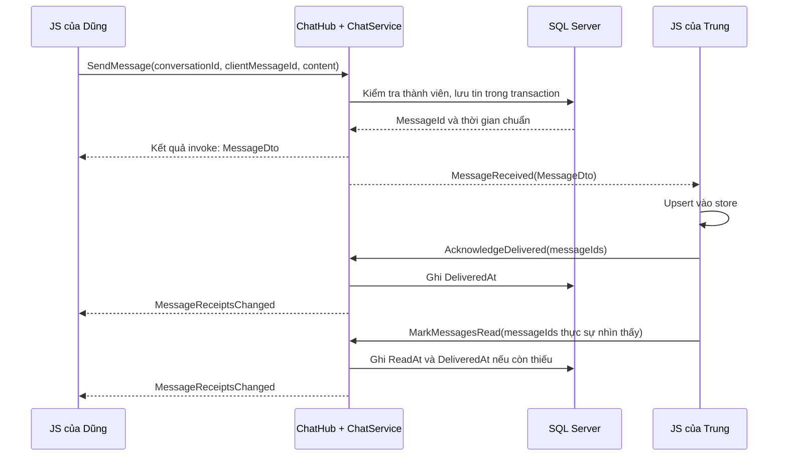
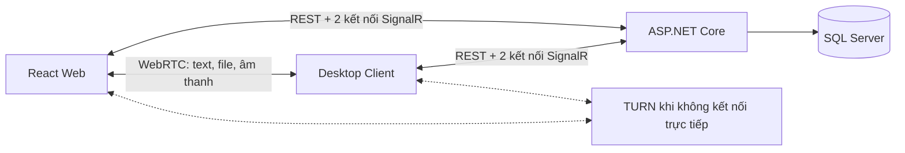
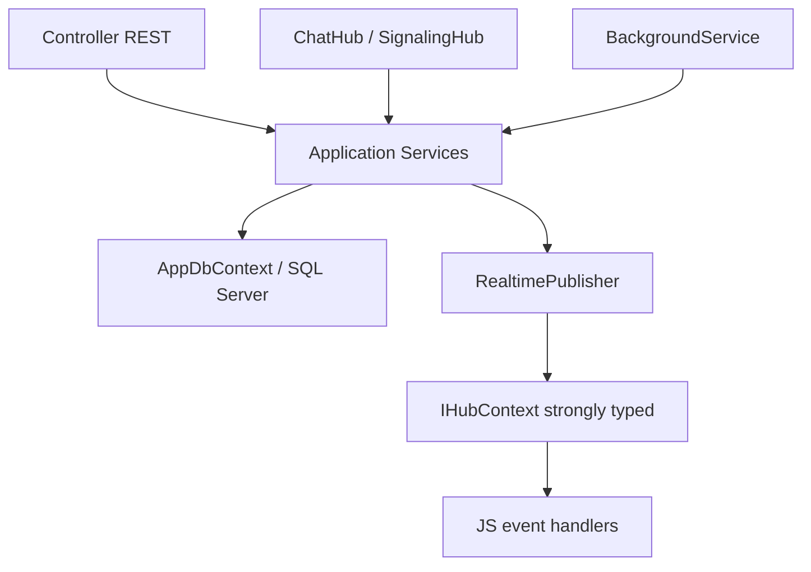

# Đặc tả triển khai hệ thống chat PBL4 với ASP.NET Core SignalR

Ngày: 27/09/2026. Phiên bản: 1.0 — thiết kế đề xuất để triển khai.

Nhóm: Nguyễn Hoàng Dũng, Nguyễn Hoàng Duy, Nguyễn Thành Trung.

Công nghệ bám theo mã nguồn: ASP.NET Core **.NET 10**, EF Core, SQL Server, React + JavaScript; WebRTC cho đường truyền P2P. Đây là tài liệu thiết kế, **chưa phải các chức năng đã được lập trình**. Các đoạn code là hợp đồng và mẫu triển khai có chú thích; những service, store, adapter được nhắc tới phải được xây dựng theo đặc tả.

## Cách đọc

Đọc mục 1–4 để hiểu nghiệp vụ. Mục 5–8 là hợp đồng backend; mục 9–12 là frontend và cách nối hai phía; mục 13–16 là quy tắc triển khai, kiểm thử và lộ trình. Chưa cần học WebRTC trước khi hoàn thành luồng chat SignalR đầu tiên.

Tra nhanh: [nghiệp vụ](#nghiep-vu) · [DTO](#dto) · [ChatHub](#chat-hub) · [SignalingHub](#signaling-hub) · [REST API](#rest-api) · [ba nhóm JavaScript](#javascript) · [mất mạng và đồng bộ](#dong-bo) · [lộ trình](#lo-trinh).

## 1. Dự án đang có gì và cần xây dựng gì?

Đã kiểm tra `PBL4/Program.cs`, `PBL4/PBL4.csproj`, `PBL4/Models`, `PBL4/Data/AppDBContext.cs`, `database/01_schema.sql`, `database/README.md`, `frontend/src/App.jsx` và `frontend/package.json`.

| Thành phần | Hiện trạng | Công việc tiếp theo |
|---|---|---|
| Backend | Target `net10.0`, đăng ký DbContext SQL Server, controllers và OpenAPI | Thêm xác thực, phân quyền, service nghiệp vụ, SignalR |
| Model | Có Users, Contacts, DirectConversations, Messages, Calls, FileTransfers, AdminAuditLogs | Đối chiếu mapping EF với script SQL trước khi tạo migration |
| Controller | Chỉ thấy controller WeatherForecast mẫu | Xây các controller REST trong mục 8 |
| SignalR | Chưa có Hub, chưa `AddSignalR`/`MapHub` | Xây ChatHub và SignalingHub |
| React | Trang đã tách; chat cập nhật React state từ mock data | Thay mock bằng API, realtime store và handler |
| Đăng nhập | `authenticated = true` trong giao diện mẫu | Thay bằng phiên xác thực thật |
| JavaScript SignalR | Chưa có `@microsoft/signalr` trong dependencies | Thêm client tương thích .NET 10 khi triển khai |

DB hiện có lưu **bản sao tất cả tin nhắn text**, kể cả tin truyền P2P; file và âm thanh không lưu trên server. Vì vậy bản thiết kế này không tuyên bố text P2P loại bỏ hoàn toàn tải server hoặc có mã hóa đầu cuối. Server vẫn biết nội dung text để phục vụ lịch sử. Thiết kế DB đã có lựa chọn này trong [database/README.md](../database/README.md).

<a id="nghiep-vu"></a>

## 2. Hiểu nghiệp vụ bằng một cuộc trò chuyện

### 2.1. Dũng gửi “14h họp nhóm nha” cho Trung

1. Dũng đăng nhập. Backend xác thực và trả token, thông tin tài khoản.
2. Frontend mở kết nối `ChatHub` bằng token. Server nhận biết đây là Dũng qua claim, không tin một `senderId` do JS tự gửi.
3. Dũng tìm Trung và bấm Nhắn tin. Frontend gọi REST để lấy hoặc tạo cuộc trò chuyện Dũng–Trung. Server trả `conversationId`.
4. Frontend tải lịch sử của cuộc trò chuyện. Đây là dữ liệu đã lưu, đọc bằng REST.
5. Dũng nhập nội dung. Frontend tạo `clientMessageId` một lần, hiển thị bóng tin với trạng thái **Đang gửi**.
6. JS gọi `chatConnection.invoke("SendMessage", dto)`. Hub kiểm tra quyền, lưu DB, trả bản ghi chuẩn có `messageId`, thời gian server và trạng thái nhận/đọc.
7. Nếu Trung đang kết nối, backend đẩy `MessageReceived` đến các kết nối của Trung. Trung không cần liên tục gọi API hỏi “có tin mới chưa?”.
8. JS của Trung nhận event, đưa tin vào store rồi gọi `AcknowledgeDelivered`. Backend đặt `DeliveredAt` và thông báo lại Dũng.
9. Khi Trung mở cuộc trò chuyện và tin thực sự xuất hiện trong vùng nhìn thấy, JS gọi `MarkMessagesRead`. Backend đặt `ReadAt`, gửi trạng thái **Đã đọc** cho Dũng.



Kết quả `invoke` và event có thể tới khác thứ tự minh họa. Frontend phải gộp theo ID, không phụ thuộc vào việc cái nào đến trước.

### 2.2. Khi Trung offline

Dũng vẫn gửi và server vẫn lưu. Tin ở trạng thái **Đã gửi**, chưa có `DeliveredAt`. Khi Trung quay lại, frontend kết nối Hub trước, rồi tải những tin chưa nhận qua REST. Sau khi đưa dữ liệu vào store mới gửi ACK. Hub không tự cất event để phát lại khi người dùng online.

### 2.3. Bốn khái niệm rất dễ nhầm

| Khái niệm | Ví dụ | Ý nghĩa |
|---|---|---|
| UserId | `3` | Danh tính tài khoản, ổn định |
| ConnectionId | chuỗi do SignalR sinh | Một kết nối của một tab/app; reconnect có thể đổi |
| ConversationId | `"125"` | Cuộc trò chuyện lâu dài của hai tài khoản, lưu trong DB |
| PeerSessionId | UUID | Một phiên thiết lập WebRTC giữa hai endpoint, có thời hạn |

Dũng có thể mở web và desktop: một UserId nhưng nhiều ConnectionId. Đóng rồi mở lại app vẫn là cùng ConversationId. Tạo lại đường truyền WebRTC sinh PeerSessionId khác.

`UserAID = min(user1, user2)` và `UserBID = max(user1, user2)` chỉ chuẩn hóa cặp người tham gia. A không có nghĩa là người gửi. Người gửi từng tin nằm ở `Messages.SenderId`.

### 2.4. Trạng thái hiển thị phải có bằng chứng

| Trạng thái UI | Bằng chứng |
|---|---|
| Đang gửi | Có bản nháp local, chưa có xác nhận lưu từ backend |
| Đã gửi | Backend đã commit bản ghi Messages |
| Đã nhận | Một client của người nhận đã ACK; server đã ghi DeliveredAt |
| Đã đọc | Người nhận báo đã nhìn thấy tin; server đã ghi ReadAt |
| Chưa rõ kết quả | Invoke bị ngắt; cần tra/retry với cùng ClientMessageId |
| Gửi thất bại | Backend từ chối hoặc không gửi được sau xử lý retry |

`await Clients.User(...).MessageReceived(...)` hoàn thành không chứng minh người nhận đã xem hoặc xử lý tin. ACK ở bước 8 là nghiệp vụ riêng của ứng dụng.

## 3. Phạm vi và những quyết định triển khai

MVP gồm đăng ký/đăng nhập, danh bạ một chiều, chat 1–1, lịch sử và tin offline, online/offline, đang nhập, gọi thoại, truyền file, admin khóa/mở tài khoản và audit log. Chưa xây chat nhóm, kết bạn có phê duyệt, video call, sửa/xóa tin và đồng bộ offline hoàn chỉnh theo từng thiết bị.

Một user vẫn được mở nhiều tab. Bản MVP xử lý fan-out, chống trùng, tranh chấp nhận cuộc gọi; receipt được hiểu theo **tài khoản**, không phải từng thiết bị. Muốn biết desktop đã nhận nhưng web chưa nhận cần thêm bảng receipt theo thiết bị.

Chọn hai Hub cho dự án này. Đây là quyết định tổ chức mã, không phải yêu cầu SignalR bắt buộc phải có hai Hub.

| Hub | Route | Nhiệm vụ |
|---|---|---|
| `ChatHub : Hub<IChatClient>` | `/hubs/chat` | Tin nhắn, ACK, typing, presence, trạng thái call/file, thông báo tài khoản |
| `SignalingHub : Hub<ISignalingClient>` | `/hubs/signaling` | Chọn endpoint P2P, chuyển SDP Offer/Answer và ICE, đóng phiên signaling |

Chưa cần PresenceHub, FileHub, CallHub hoặc AdminHub riêng. Presence thuộc ChatHub; call/file là bản ghi nghiệp vụ điều khiển bằng ChatHub; signaling WebRTC thuộc SignalingHub. Admin thao tác bằng REST, thông báo tới user qua ChatHub.

### 3.1. REST, SignalR, WebRTC mỗi cái làm gì?

| Kênh | Dữ liệu | Vì sao |
|---|---|---|
| REST | Login, danh sách, lịch sử có phân trang, cấu hình, quản trị | Request/response rõ ràng, dễ tải lại, dễ kiểm thử |
| SignalR | Lệnh realtime và thông báo sự kiện, SDP/ICE | Kết nối hai chiều; server chủ động thông báo |
| WebRTC DataChannel | Nội dung text P2P ở giai đoạn 2, các chunk file | Truyền dữ liệu trực tiếp hoặc qua TURN khi cần |
| WebRTC media | Âm thanh gọi thoại | Đường truyền media, không gửi âm thanh vào Hub |



WebRTC cần kênh signaling để trao đổi SDP/ICE; trong dự án này chọn SignalR làm kênh đó. Các candidate ICE nhận sớm phải được đợi tới sau `setRemoteDescription` mới đưa vào peer connection. [MDN: signaling WebRTC](https://developer.mozilla.org/en-US/docs/Web/API/WebRTC_API/Signaling_and_video_calling).

### 3.2. Thứ tự xây dựng

Giai đoạn 1: text đi qua SignalR để hoàn thành nghiệp vụ lưu, nhận, đọc, offline. Giai đoạn 2: thêm lựa chọn text đi P2P nhưng giữ bản sao server theo DB đã chọn. Gọi thoại và byte file luôn đi WebRTC trong phạm vi thiết kế cuối cùng.

## 4. Hợp đồng chung giữa frontend và backend

**DTO** là cấu trúc dữ liệu trao đổi. DTO không tự chạy nghiệp vụ và không đồng nghĩa với entity EF. Không trả entity User trực tiếp vì có PasswordHash và navigation không cần công khai.

**Strongly typed Hub**: `Hub<IChatClient>` kiểm tra kiểu của các lời gọi **server → client** trong C#. Hàm client → server là các public method trên Hub. Có thể thêm `IChatServer` để compiler kiểm tra class Hub thực hiện đủ phương thức, nhưng interface này không tự sinh JS proxy hoặc làm JavaScript có type safety. JS đăng ký đúng tên event bằng `connection.on`, gửi lệnh bằng `connection.invoke`. [Microsoft: Hub và strongly typed Hub](https://learn.microsoft.com/en-us/aspnet/core/signalr/hubs?view=aspnetcore-10.0).

Quy ước cho toàn tài liệu:

| Nội dung | Quy ước |
|---|---|
| Tên C# | PascalCase |
| JSON DTO | camelCase: `ConversationId` → `conversationId` |
| Tên Hub method/event | Giữ chính xác tên PascalCase trong contract |
| User ID | C# int / JS number |
| ID bảng BIGINT | DTO C# string / JSON string, ví dụ `"125"`; entity vẫn long |
| Lý do dùng string cho BIGINT | Tránh vượt số nguyên an toàn của JS; không `Number(messageId)` |
| So sánh ID tại JS | Khi cần dùng `BigInt(id)` hoặc so sánh decimal đúng; không so từ điển |
| UUID | C# Guid / JSON string; JS `crypto.randomUUID()` |
| Thời gian | UTC ISO 8601, ví dụ `2026-09-27T07:15:30.000Z`; do server cấp |
| Concurrency version | `RowVersion` trả base64; xem như token opaque, không so từ điển |
| Hash file | SHA-256 hex 64 ký tự; service đổi sang byte[32] khi lưu DB |
| Nội dung tin | Text thuần sau trim, 1–4000 ký tự; render bằng React text, không HTML tùy ý |
| Phân trang | `limit` mặc định 50, tối đa 100; cursor opaque |
| Lệnh retry | Giữ ClientMessageId/ClientCallId/ClientTransferId/RequestId cũ |

C# DTO dùng `string` cho ID không thay kiểu khóa trong DB. Service phải parse số nguyên dương và kiểm tra phạm vi `long`, trả `VALIDATION_ERROR` khi sai.

### 4.1. Kết quả Hub và lỗi

```csharp
// Lỗi nghiệp vụ an toàn để hiển thị; không đưa stack trace/SQL vào Message.
public record ErrorDto(string Code, string Message, string? Field = null);

// Ok=true thì Data có giá trị, Error=null; Ok=false thì Data=null, Error có giá trị.
// Lỗi kết nối/protocol vẫn có thể làm invoke reject, ngoài Result này.
public record HubResult<T>(bool Ok, T? Data, ErrorDto? Error);

// Kết quả cho lệnh không tạo tài nguyên: server đã nhận và xử lý lệnh.
public record AckDto(DateTimeOffset ServerTime);

// Trang dữ liệu theo cursor. NextCursor=null nghĩa đã hết trang theo truy vấn đó.
public record PageDto<T>(IReadOnlyList<T> Items, string? NextCursor);
```

Mã lỗi thống nhất: `VALIDATION_ERROR`, `FORBIDDEN`, `NOT_FOUND`, `ACCOUNT_DISABLED`, `IDEMPOTENCY_CONFLICT`, `STATE_CONFLICT`, `BUSY`, `PEER_UNAVAILABLE`, `SESSION_EXPIRED`, `RATE_LIMITED`, `UNAUTHENTICATED`. REST dùng HTTP status + ProblemDetails có trường `code` tương ứng. Hub dùng `HubResult<T>` cho lỗi nghiệp vụ dự kiến; log lỗi bất ngờ với trace ID rồi trả thông báo chung.

### 4.2. Không tin danh tính do frontend gửi

Backend lấy SenderId/CallerId/AdminUserId từ token. Với một ConversationId phải kiểm tra user là UserAID hoặc UserBID; người còn lại được backend suy ra. Admin không mặc nhiên được đọc tin nhắn riêng. DTO không cho client tự gán Role, CreatedAt, DeliveredAt, ReadAt hoặc trạng thái thành công.

<a id="dto"></a>

## 5. DTO nghiệp vụ

Các record dưới đây đặt trong namespace `PBL4.Contracts.V1` khi triển khai. Cần thêm `using System; using System.Collections.Generic;` nếu project không bật implicit usings.

### 5.1. User, danh bạ và conversation

```csharp
// Thông tin công khai, không chứa hash mật khẩu; Role chỉ có trong CurrentUserDto.
public record UserSummaryDto(int Id, string Username, string DisplayName);
public record CurrentUserDto(int Id, string Username, string DisplayName, string Role);
public record ContactDto(UserSummaryDto User, string? Alias, DateTimeOffset CreatedAt);

// LastMessage=null nếu chưa chat; UnreadCount chỉ tính tin người khác gửi chưa đọc.
public record ConversationDto(
    string Id, UserSummaryDto OtherUser, DateTimeOffset CreatedAt,
    MessageDto? LastMessage, int UnreadCount);

// Online dựa trên kết nối ChatHub đang sống, không dựa vào tab đang mở đoạn chat.
public record PresenceDto(int UserId, bool IsOnline, DateTimeOffset? LastSeenAt);
public record ConversationSubscriptionDto(string ConversationId);
public record TypingRequestDto(string ConversationId, bool IsTyping);
public record TypingDto(string ConversationId, int UserId, bool IsTyping,
    DateTimeOffset ExpiresAt);
```

### 5.2. Tin nhắn và receipt

```csharp
// Route chỉ nhận "server" hoặc "peer". PeerSessionId bắt buộc khi Route="peer".
// Retry cùng ClientMessageId phải giữ nguyên ConversationId và Content.
public record SendMessageDto(
    string ConversationId, Guid ClientMessageId, string Content,
    string Route, Guid? PeerSessionId);

// Bản tin chuẩn lấy từ DB; dùng để reconcile bóng tin optimistic của người gửi.
public record MessageDto(
    string Id, Guid ClientMessageId, string ConversationId, int SenderId,
    string Content, DateTimeOffset CreatedAt,
    DateTimeOffset? DeliveredAt, DateTimeOffset? ReadAt, string Version);

// Thông báo có bản tin đã lưu khi payload đang ưu tiên truyền P2P.
// Không chứa Content; nếu chờ P2P quá hạn, người nhận tải tin qua REST.
public record MessageAvailableDto(
    string MessageId, Guid ClientMessageId, string ConversationId, int SenderId);

// ACK tối đa 100 ID/lần. Chỉ ACK tin thuộc conversation, do người kia gửi.
public record MessageIdsDto(string ConversationId, IReadOnlyList<string> MessageIds);
public record MessageReceiptDto(string MessageId, DateTimeOffset? DeliveredAt,
    DateTimeOffset? ReadAt);
public record MessageReceiptsDto(string ConversationId,
    IReadOnlyList<MessageReceiptDto> Receipts);
```

### 5.3. Gọi thoại

```csharp
// ClientCallId tạo trước lệnh gọi và giữ nguyên nếu mất kết quả rồi retry.
public record StartCallDto(string ConversationId, Guid ClientCallId);

// State mutation đều kèm RowVersion mà client biết. Server vẫn phải kiểm tra vai trò.
public record CallActionDto(string CallId, string ExpectedVersion);
// Reason chỉ nhận "hangup", "cancel", "connection-failed".
public record EndCallDto(string CallId, string ExpectedVersion, string Reason);

// ReceiverId suy ra từ conversation; không cần thêm cột ReceiverId vào Calls.
public record CallDto(string Id, Guid ClientCallId, string ConversationId,
    int CallerId, int ReceiverId, string Status, DateTimeOffset CreatedAt,
    DateTimeOffset? AnsweredAt, DateTimeOffset? EndedAt, string Version);
```

### 5.4. Truyền file

```csharp
// MVP giới hạn 100 MiB/file; FileSizeBytes là số an toàn trong giới hạn này.
// Không chứa byte file. Sha256Hex tính tại thiết bị gửi trước khi gửi lời mời.
public record OfferFileDto(string ConversationId, Guid ClientTransferId,
    string FileName, long FileSizeBytes, string Sha256Hex);
public record FileActionDto(string TransferId, string ExpectedVersion);
public record FailFileDto(string TransferId, string ExpectedVersion, string Reason);

// Chỉ bên nhận được xác nhận hoàn tất sau khi đã ghép đủ byte và kiểm tra hash.
public record CompleteFileDto(string TransferId, string ExpectedVersion,
    long ReceivedBytes, string VerifiedSha256Hex);

public record FileTransferDto(string Id, Guid ClientTransferId,
    string ConversationId, int SenderId, int ReceiverId,
    string FileName, long FileSizeBytes, string Sha256Hex,
    string? VerifiedSha256Hex, string Status, DateTimeOffset CreatedAt,
    DateTimeOffset? AcceptedAt, DateTimeOffset? FinishedAt, string Version);

// Tiến độ là thông tin tạm; không ghi DB mỗi chunk.
public record FileProgressRequestDto(string TransferId, long TransferredBytes);
public record FileProgressDto(string TransferId, int ReporterId,
    long TransferredBytes, long TotalBytes, DateTimeOffset ReportedAt);
```

### 5.5. Quản trị

```csharp
// Event gửi cho chính tài khoản bị tác động; UI đóng kết nối và yêu cầu đăng nhập lại.
public record AccountStateDto(bool IsDisabled, string Code);
public record AdminUserDto(int Id, string Username, string DisplayName,
    string Role, bool IsDisabled, string Version);

// RequestId chống lặp thao tác, ExpectedVersion bảo vệ khi hai admin cùng cập nhật.
public record SetAccountStateDto(bool IsDisabled, string Reason,
    Guid RequestId, string ExpectedVersion);
public record AdminAuditDto(string Id, Guid RequestId, int AdminUserId,
    int TargetUserId, string Action, bool OldIsDisabled, bool NewIsDisabled,
    string Reason, DateTimeOffset CreatedAt);
```

<a id="chat-hub"></a>

## 6. ChatHub: interface và nghiệp vụ cụ thể

### 6.1. Interface strongly typed server → client

```csharp
public interface IChatClient
{
    /// <summary>Nhận bản tin chuẩn; JS upsert theo Id hoặc (SenderId, ClientMessageId).</summary>
    Task MessageReceived(MessageDto message);

    /// <summary>Text đã lưu, đang chờ P2P; JS đặt hạn chờ rồi tải REST nếu chưa nhận.</summary>
    Task MessageAvailable(MessageAvailableDto message);

    /// <summary>Cập nhật receipt một chiều tăng dần, không xóa trạng thái đã đọc.</summary>
    Task MessageReceiptsChanged(MessageReceiptsDto data);

    /// <summary>Báo conversation mới hoặc cần tải lại preview/unread bằng REST.</summary>
    Task ConversationChanged(ConversationSubscriptionDto data);

    /// <summary>Cập nhật online/offline của một người được phép theo dõi.</summary>
    Task PresenceChanged(PresenceDto data);

    /// <summary>Hiển thị hoặc xóa “đang nhập”; tự xóa khi ExpiresAt đến hạn.</summary>
    Task TypingChanged(TypingDto data);

    /// <summary>Cuộc gọi đến; chỉ hiển thị lời mời, chưa bật microphone.</summary>
    Task CallOffered(CallDto call);

    /// <summary>Trạng thái call mới; đóng popup/peer khi trạng thái kết thúc.</summary>
    Task CallChanged(CallDto call);

    /// <summary>Lời mời nhận file; người dùng phải chọn chấp nhận hoặc từ chối.</summary>
    Task FileOffered(FileTransferDto transfer);

    /// <summary>Trạng thái file mới từ server; completed chỉ sau kiểm tra hash.</summary>
    Task FileChanged(FileTransferDto transfer);

    /// <summary>Tiến độ của phía bên kia; không dùng làm bằng chứng hoàn tất.</summary>
    Task FileProgressChanged(FileProgressDto progress);

    /// <summary>Tài khoản bị khóa; client dừng realtime/P2P và xóa phiên local.</summary>
    Task AccountStateChanged(AccountStateDto state);
}
```

### 6.2. Interface client → server

Khi triển khai class: `ChatHub : Hub<IChatClient>, IChatServer`. `IChatServer` là interface do dự án tự định nghĩa để chốt chữ ký hàm; public method trên Hub là endpoint thực sự.

```csharp
public interface IChatServer
{
    /// <summary>Kiểm tra thành viên rồi thêm connection vào group typing của conversation.</summary>
    Task<HubResult<AckDto>> JoinConversation(ConversationSubscriptionDto request);
    /// <summary>Rời group typing khi đóng/chuyển cuộc trò chuyện; vẫn nhận tin cá nhân.</summary>
    Task<HubResult<AckDto>> LeaveConversation(ConversationSubscriptionDto request);

    /// <summary>Lưu tin chống trùng, trả bản chuẩn, phát event theo Route sau commit.</summary>
    Task<HubResult<MessageDto>> SendMessage(SendMessageDto request);
    /// <summary>Người nhận xác nhận đã đưa tin vào store; cập nhật DeliveredAt một lần.</summary>
    Task<HubResult<MessageReceiptsDto>> AcknowledgeDelivered(MessageIdsDto request);
    /// <summary>Người nhận xác nhận các tin thực sự đã thấy; đảm bảo ReadAt >= DeliveredAt.</summary>
    Task<HubResult<MessageReceiptsDto>> MarkMessagesRead(MessageIdsDto request);
    /// <summary>Phát typing có giới hạn tần suất, TTL 5 giây, không lưu SQL.</summary>
    Task<HubResult<AckDto>> SetTyping(TypingRequestDto request);

    /// <summary>Tạo Calls/ringing, giữ chỗ busy cho hai user và phát lời mời.</summary>
    Task<HubResult<CallDto>> StartCall(StartCallDto request);
    /// <summary>Chỉ người nhận: ringing -> active; dùng concurrency chọn thiết bị thắng.</summary>
    Task<HubResult<CallDto>> AcceptCall(CallActionDto request);
    /// <summary>Chỉ người nhận: ringing -> rejected.</summary>
    Task<HubResult<CallDto>> RejectCall(CallActionDto request);
    /// <summary>Caller hủy lúc ringing; một trong hai phía kết thúc active hoặc báo lỗi.</summary>
    Task<HubResult<CallDto>> EndCall(EndCallDto request);

    /// <summary>Tạo metadata/offered, chống trùng ClientTransferId và gửi lời mời.</summary>
    Task<HubResult<FileTransferDto>> OfferFile(OfferFileDto request);
    /// <summary>Chỉ người nhận: offered -> accepted, ghi AcceptedAt.</summary>
    Task<HubResult<FileTransferDto>> AcceptFile(FileActionDto request);
    /// <summary>Chỉ người nhận: offered -> rejected, ghi FinishedAt.</summary>
    Task<HubResult<FileTransferDto>> RejectFile(FileActionDto request);
    /// <summary>Chỉ sender, sau khi DataChannel mở: accepted -> transferring.</summary>
    Task<HubResult<FileTransferDto>> BeginFileTransfer(FileActionDto request);
    /// <summary>Hai phía báo tiến độ tối đa 2 lần/giây, không chuyển trạng thái hoàn tất.</summary>
    Task<HubResult<AckDto>> ReportFileProgress(FileProgressRequestDto request);
    /// <summary>Chỉ receiver: kiểm tra đủ byte + hash, transferring -> completed.</summary>
    Task<HubResult<FileTransferDto>> CompleteFile(CompleteFileDto request);
    /// <summary>Một trong hai phía hủy phiên chưa kết thúc; ghi cancelled.</summary>
    Task<HubResult<FileTransferDto>> CancelFile(FileActionDto request);
    /// <summary>Một trong hai phía báo lỗi phiên chưa kết thúc; ghi failed.</summary>
    Task<HubResult<FileTransferDto>> FailFile(FailFileDto request);
}
```

### 6.3. Quy tắc chi tiết cho từng nhóm lệnh

**Join/Leave:** tên group do server tạo, ví dụ `conversation:125`; không nhận tên group tùy ý. Group dùng typing, không dùng làm nguồn xác thực. Tin nhắn và lời mời gửi qua `Clients.User` để người chưa mở conversation vẫn nhận. Một user có nhiều kết nối; group không được chia sẻ giữa hai Hub và cần tham gia lại sau reconnect thông thường. [Microsoft: users và groups](https://learn.microsoft.com/en-us/aspnet/core/signalr/groups?view=aspnetcore-10.0).

**SendMessage:** xác thực → kiểm tra membership và tài khoản đích không bị khóa → validate → tra `(SenderId, ClientMessageId)` → commit → thông báo. Duplicate cùng nội dung trả lại bản ghi cũ; duplicate khác content/conversation trả `IDEMPOTENCY_CONFLICT`. Unique constraint ở DB là hàng rào cuối cùng khi hai request chạy đồng thời. Mất kết quả invoke thì retry cùng khóa, không tạo UUID mới.

Route `server`: gửi `MessageReceived` cho hai user, gồm các tab của sender. Route `peer`: chỉ chấp nhận nếu PeerSession thuộc đúng cặp và purpose=data; gửi bản chuẩn cho sender, gửi `MessageAvailable` cho receiver. Sender gửi bản chuẩn đó qua DataChannel. Nếu không có phiên peer hợp lệ, client retry Route=server cùng ClientMessageId. Route không phải nội dung bất biến của bản ghi.

Khi duplicate từ peer chuyển sang server, vẫn phải phát lại `MessageReceived` cho receiver; không được chỉ trả bản ghi cũ rồi bỏ qua fallback. Các event và kết quả invoke đều có thể lặp; frontend upsert.

**Receipt:** toàn bộ batch phải là tin do người kia gửi trong đúng conversation; có ID sai thì từ chối cả batch, không ghi một phần. `DeliveredAt`/`ReadAt` do server cấp và không giảm. MarkMessagesRead tự điền DeliveredAt nếu chưa có. Trả full receipt hiện tại cho cả batch, dù đã cập nhật trước đó. Phát `MessageReceiptsChanged` cho hai user để đồng bộ các tab.

**Typing:** sender phải ở conversation; giới hạn một lần/giây mỗi user/conversation, không tự hiển thị typing của chính mình. Server chỉ phát cho người kia đang mở conversation. Sự kiện cuối có thể mất nên luôn có ExpiresAt; không cần bảo đảm phát lại typing.

**Call:** StartCall chống trùng `(CallerId, ClientCallId)`; không cho gọi chính mình hoặc người bị khóa. MVP trả `PEER_UNAVAILABLE` nếu receiver không có ChatHub và SignalingHub endpoint khả dụng. Busy check + reserve hai user phải atomic; một process dùng registry singleton và khóa theo thứ tự ID. Unique ClientCallId không tự chặn hai call khác nhau cùng gọi một người. Khi nhiều instance phải dùng cơ chế khóa/đặt chỗ phân tán hoặc DB.

| Trạng thái đầu | Tác nhân/lệnh | Trạng thái sau | Ý nghĩa |
|---|---|---|---|
| Chưa có | Caller / StartCall | ringing | Đang mời; tối đa 30 giây |
| ringing | Receiver / AcceptCall | active | Đã chấp nhận, bắt đầu dựng media; chưa chắc đã nghe được âm thanh |
| ringing | Receiver / RejectCall | rejected | Từ chối |
| ringing | Caller / EndCall(cancel) | cancelled | Hủy trước khi nhận |
| ringing | Server / timeout | missed | Không trả lời |
| active | Một phía / EndCall(hangup) | completed | Kết thúc sau khi chấp nhận |
| ringing hoặc active | Một phía hoặc server / lỗi đường truyền | failed | Không thiết lập/duy trì được cuộc gọi |

`AnsweredAt` đặt khi AcceptCall; `EndedAt` đặt khi terminal. UI phân biệt `active` nghiệp vụ với WebRTC `connected`. Nếu sau accept 15 giây không kết nối media thì failed. Thời lượng `EndedAt - AnsweredAt` là thời gian sau nhận lời; muốn thời lượng media chính xác cần thêm MediaConnectedAt sau này.

**File:** chỉ offer metadata khi receiver khả dụng; lời mời quá 60 giây thành expired. Sau accept, tạo WebRTC và BeginFileTransfer trước khi gửi chunk. Chỉ receiver được CompleteFile, với số byte đúng FileSizeBytes và SHA trùng. Sai hash gọi FailFile hoặc backend chuyển failed; không ghi VerifiedSha256 khi trạng thái chưa completed. Giới hạn MVP 100 MiB, chunk đề xuất 16 KiB và hàng đợi có backpressure.

Chuỗi trạng thái: `offered -> accepted -> transferring -> completed`. Nhánh: `offered -> rejected/expired`; phiên chưa kết thúc có thể `cancelled/failed`. RowVersion giải quyết accept/reject/cancel đồng thời; terminal state không được lùi. Retry cùng action sau khi đã thành công trả trạng thái hiện tại; nếu action mâu thuẫn với terminal state thì `STATE_CONFLICT`.

Mỗi event CallChanged/FileChanged mang snapshot. Client nhận snapshot ngoài thứ tự phải tải lại REST khi Version khác snapshot đang giữ và không biết thứ tự; không so base64 RowVersion theo chữ cái. Với receipt có thể merge timestamp theo hướng tăng vì trạng thái chỉ tiến lên.

Trong các mô tả gửi theo UserId ở trên, `Clients.User` diễn tả fan-out khi mọi phiên của user còn hợp lệ. Khi có thu hồi từng sid, RealtimePublisher phải tra registry và dùng typed `Clients.Clients(validConnectionIds)` để chỉ gửi vào các connection còn quyền; gọi `Clients.User` vô điều kiện sẽ gửi cả vào socket của phiên vừa logout. Registry tách riêng theo Hub.

### 6.4. Vòng đời kết nối và presence

`OnConnectedAsync`: xác thực account enabled; registry ghi UserId → tập ConnectionId của ChatHub; khi chuyển 0 → 1 connection, phát online cho những người được phép theo dõi.

`OnDisconnectedAsync`: loại đúng connection; user chỉ offline khi tập còn 0 sau grace period đề xuất 10 giây. Nếu reconnect trong khoảng này thì hủy offline. Ghi LastSeenAt theo thời gian server khi thực sự offline. Presence là trạng thái gần đúng do phát hiện mất mạng cần timeout.

Chỉ đếm ChatHub cho presence, không cộng SignalingHub thành một “người online” nữa. Watcher hợp lệ là user có người đó trong Contacts hoặc cùng DirectConversation; khi thay danh bạ, cập nhật subscription server. Không broadcast danh sách online toàn hệ thống.

Registry nằm trong service dùng chung, không nằm trong field của Hub vì Hub không phải đối tượng sống lâu cho cả phiên. Controller/worker phát sự kiện qua `IHubContext<ChatHub, IChatClient>`. [Microsoft: Hub lifecycle và truy cập client](https://learn.microsoft.com/en-us/aspnet/core/signalr/hubs?view=aspnetcore-10.0).

<a id="signaling-hub"></a>

## 7. SignalingHub: thiết lập WebRTC

SignalR không tạo SDP hay tự tìm đường P2P. Trình duyệt hoặc thư viện WebRTC của desktop làm việc đó; Hub kiểm tra quyền rồi chuyển thông tin giữa hai endpoint được chọn.

### 7.1. DTO signaling

```csharp
// Purpose: "data" (text P2P), "call", "file".
// ResourceId: CallId khi call, TransferId khi file, null khi data.
public record BeginPeerSessionDto(Guid RequestId, string ConversationId,
    string Purpose, string? ResourceId);
public record PeerSessionActionDto(Guid PeerSessionId);

// Role: "offerer" hoặc "answerer", được server quyết định.
// Status: "pending", "ready", "closed". Không đưa ConnectionId của peer cho UI.
public record PeerSessionDto(Guid PeerSessionId, string ConversationId,
    int OtherUserId, string Purpose, string? ResourceId,
    string Role, string Status, DateTimeOffset ExpiresAt);
public record PeerClosedDto(Guid PeerSessionId, string Reason);

// SendOffer chỉ nhận Type="offer"; SendAnswer chỉ nhận Type="answer".
public record SdpDto(Guid PeerSessionId, string Type, string Sdp);

// Candidate null biểu thị hết candidate cho phiên này; giữ nguyên string candidate.
public record IceCandidateDto(Guid PeerSessionId, string? Candidate,
    string? SdpMid, int? SdpMLineIndex, string? UsernameFragment);

// Dữ liệu REST cung cấp STUN/TURN; credential TURN có thời hạn.
public record IceServerDto(IReadOnlyList<string> Urls, string? Username, string? Credential);
public record RtcConfigurationDto(IReadOnlyList<IceServerDto> IceServers,
    DateTimeOffset ExpiresAt);
```

### 7.2. Strongly typed interface server → client

```csharp
public interface ISignalingClient
{
    /// <summary>Mời endpoint đích claim phiên; call/file chỉ claim ở thiết bị đã nhận lời.</summary>
    Task PeerSessionOffered(PeerSessionDto session);
    /// <summary>Đã chọn cặp endpoint; offerer tạo offer, answerer chờ offer.</summary>
    Task PeerSessionReady(PeerSessionDto session);
    /// <summary>Nhận offer; tạo peer, setRemoteDescription, tạo và gửi answer.</summary>
    Task OfferReceived(SdpDto offer);
    /// <summary>Offerer nhận answer; setRemoteDescription rồi xử lý ICE đang đợi.</summary>
    Task AnswerReceived(SdpDto answer);
    /// <summary>Nhận candidate; queue nếu chưa có remoteDescription, không bỏ mất.</summary>
    Task IceCandidateReceived(IceCandidateDto candidate);
    /// <summary>Phiên đóng/quá hạn; giải phóng peer, timer, track và dữ liệu tạm.</summary>
    Task PeerSessionClosed(PeerClosedDto data);
}
```

### 7.3. Interface client → server

Class triển khai: `SignalingHub : Hub<ISignalingClient>, ISignalingServer`.

```csharp
public interface ISignalingServer
{
    /// <summary>Tạo phiên pending, gắn offerer với connection hiện tại và phát lời mời.</summary>
    Task<HubResult<PeerSessionDto>> BeginPeerSession(BeginPeerSessionDto request);
    /// <summary>Receiver claim atomic một phiên; gắn answerer với connection hiện tại.</summary>
    Task<HubResult<PeerSessionDto>> ClaimPeerSession(PeerSessionActionDto request);
    /// <summary>Chỉ offerer đã bind; chuyển SDP đến đúng connection answerer.</summary>
    Task<HubResult<AckDto>> SendOffer(SdpDto request);
    /// <summary>Chỉ answerer đã bind; chuyển SDP đến đúng connection offerer.</summary>
    Task<HubResult<AckDto>> SendAnswer(SdpDto request);
    /// <summary>Mỗi endpoint gửi ICE cho endpoint còn lại; kiểm tra session đang hiệu lực.</summary>
    Task<HubResult<AckDto>> SendIceCandidate(IceCandidateDto request);
    /// <summary>Mỗi bên có quyền đóng phiên của mình; đóng lặp là idempotent.</summary>
    Task<HubResult<AckDto>> ClosePeerSession(PeerSessionActionDto request);
}
```

### 7.4. Ràng buộc phiên, đa tab và reconnect

Registry lưu `{sessionId, conversationId, purpose, resourceId, offererUserId, offererConnectionId, answererUserId, answererConnectionId, expiresAt, state}`. Không chuyển SDP tới `Clients.User` sau khi đã chọn cặp; dùng `Clients.Client` trên chính SignalingHub để tránh mọi tab cùng tạo answer.

Mỗi phiên logic đăng nhập/tab có `clientInstanceId` UUID. Khi nối hai Hub, client gửi cùng `clientInstanceId` trong URL; server bind `(UserId, clientInstanceId)` với hai ConnectionId. Đây chỉ là correlation ID, không phải quyền truy cập. UserId phải lấy từ token. Hai tab phải sinh ID khác nhau trong bộ nhớ tab, không dùng localStorage chung.

Với call/file, thiết bị thắng AcceptCall/AcceptFile được lưu trong registry nghiệp vụ. Chỉ SignalingHub connection thuộc cùng `(UserId, clientInstanceId)` đó được ClaimPeerSession. Chỉ thiết bị đã khởi tạo call/offer file được BeginPeerSession cho tài nguyên ấy. WebRTC data chat chọn một receiver endpoint claim đầu tiên.

RequestId chống tạo phiên trùng trên cùng kết nối. Mỗi phiên chỉ một offerer; với call là caller, file là sender. Với data, server cấp một phiên hiệu lực cho cặp user; yêu cầu đồng thời từ phía còn lại tham gia phiên đã có và nhận đúng Role. Không dựa vào ai bấm trước ở JS để xử lý xung đột SDP.

Phiên pending hết hạn sau 30 giây; phiên ready dữ liệu tối đa 10 phút trong MVP, call/file bị đóng khi tài nguyên terminal. Có thể tạo lại data session sau hết hạn. Giới hạn đề xuất: SDP tối đa 64 KiB, candidate tối đa 4 KiB, tối đa 128 candidate mỗi phía mỗi phiên. Kiểm tra state, membership, endpoint bind, purpose và account enabled ở mỗi lệnh.

Signaling reconnect có ConnectionId mới: MVP đóng phiên cũ, dựng phiên mới; không chỉ sửa ConnectionId trong một session đang trao đổi SDP. Text chuyển tạm về server. Call đang active hoặc file đang truyền đánh dấu failed khi vượt grace period; người dùng chủ động thử lại, không tự tạo cuộc gọi mới. Candidate đến cho session cũ bị bỏ.

<a id="rest-api"></a>

## 8. REST API và các controller

REST quản lý **tài nguyên**: dùng đường dẫn danh từ số nhiều; GET không thay dữ liệu; POST tạo tài nguyên; PUT thay trạng thái của một tài nguyên xác định; PATCH sửa một phần; DELETE xóa liên kết/phiên được phép xóa. Route version `/api/v1`.

### 8.1. DTO REST bổ sung

```csharp
// Server hash password bằng thư viện chuẩn; không lưu hoặc log password dạng rõ.
public record RegisterUserDto(string Username, string DisplayName, string Password);
public record CreateSessionDto(string Username, string Password);
// Token giữ trong bộ nhớ JS. MVP token 30 phút, hết hạn đăng nhập lại; chưa có refresh.
public record AuthSessionDto(string SessionId, string AccessToken,
    DateTimeOffset ExpiresAt, CurrentUserDto User);
public record UpdateProfileDto(string DisplayName, string ExpectedVersion);
public record SetContactDto(string? Alias);
public record CreateConversationDto(int OtherUserId);
```

| Controller / hàm action đề xuất | HTTP và route | Input | Output thành công | Công việc/kiểm tra |
|---|---|---|---|---|
| UsersController.Register | POST `/users` | RegisterUserDto | 201 UserSummaryDto + Location | Unique username; role luôn User |
| SessionsController.Create | POST `/sessions` | CreateSessionDto | 201 AuthSessionDto | Kiểm tra hash và enabled; rate limit; lỗi login chung |
| SessionsController.DeleteCurrent | DELETE `/sessions/current` | Không body | 204 | Thu hồi sid hiện tại; client đóng cả hai Hub và peer |
| UsersController.GetMe | GET `/users/me` | Token | 200 CurrentUserDto + ETag | Danh tính hiện tại; ETag là RowVersion của user |
| UsersController.UpdateMe | PATCH `/users/me` | UpdateProfileDto | 200 CurrentUserDto + ETag | Chỉ sửa DisplayName, không nhận Role/IsDisabled |
| UsersController.Search | GET `/users?query=&cursor=&limit=` | Query | 200 PageDto<UserSummaryDto> | Giới hạn query; không lộ PasswordHash; ẩn tài khoản bị khóa |
| UsersController.GetById | GET `/users/{userId}` | int | 200 UserSummaryDto | Thông tin công khai theo chính sách tìm kiếm |
| ContactsController.List | GET `/users/me/contacts?cursor=&limit=` | Query | 200 PageDto<ContactDto> | Chỉ danh bạ của user token |
| ContactsController.Put | PUT `/users/me/contacts/{contactUserId}` | SetContactDto | 201 hoặc 200 ContactDto | Tạo/cập nhật alias; không tự thêm chiều ngược lại |
| ContactsController.Delete | DELETE `/users/me/contacts/{contactUserId}` | int | 204 kể cả đã vắng | Xóa liên hệ, không xóa conversation/tin |
| ConversationsController.Create | POST `/conversations` | CreateConversationDto | 201 nếu mới, 200 nếu đã có; ConversationDto | Chuẩn hóa A/B, giải quyết unique race, phát ConversationChanged cho hai phía |
| ConversationsController.List | GET `/conversations?cursor=&limit=` | Query | 200 PageDto<ConversationDto> | Chỉ conversation mình tham gia; sort hoạt động mới nhất |
| ConversationsController.Get | GET `/conversations/{id}` | string BIGINT | 200 ConversationDto | Snapshot preview và unread; kiểm tra membership |
| MessagesController.List | GET `/conversations/{id}/messages?before=&limit=` | Cursor lịch sử | 200 PageDto<MessageDto> | Lịch sử mới → cũ; cursor `(CreatedAt, Id)`; UI đảo thứ tự khi hiển thị |
| MessagesController.Get | GET `/conversations/{id}/messages/{messageId}` | Hai ID | 200 MessageDto | Tin phải thuộc đúng conversation |
| MessagesController.GetByClientId | GET `/conversations/{id}/messages?clientMessageId={uuid}` | UUID | 200 MessageDto hoặc 404 | Tra tin do chính user hiện tại gửi khi mất kết quả invoke |
| MessagesController.Pending | GET `/users/me/pending-messages?cursor=&limit=` | Cursor | 200 PageDto<MessageDto> | Tin người khác gửi cho mình và DeliveredAt=null; không tự đánh dấu đã nhận khi GET |
| PresenceController.List | GET `/presence?userIds=1,2,3` | Tối đa 100 ID | 200 PresenceDto[] | Chỉ contact/conversation được phép xem |
| CallsController.List | GET `/calls?conversationId=&cursor=&limit=` | Query | 200 PageDto<CallDto> | Cuộc gọi mình tham gia, kể cả missed |
| CallsController.Get | GET `/calls/{id}` | ID | 200 CallDto | Đồng bộ trạng thái sau event/reconnect |
| FilesController.List | GET `/file-transfers?conversationId=&cursor=&limit=` | Query | 200 PageDto<FileTransferDto> | Metadata phiên mình tham gia |
| FilesController.Get | GET `/file-transfers/{id}` | ID | 200 FileTransferDto | Không trả nội dung file |
| RtcController.GetConfiguration | GET `/rtc/configuration` | Token | 200 RtcConfigurationDto | Cấp STUN/TURN credential ngắn hạn, Cache-Control: no-store |
| AdminUsersController.List | GET `/admin/users?query=&cursor=&limit=` | Admin | 200 PageDto<AdminUserDto> | Có trạng thái enabled/disabled, không có PasswordHash |
| AdminUsersController.PutState | PUT `/admin/users/{id}/account-state` | SetAccountStateDto | 200 AdminUserDto | Admin; ghi trạng thái và log trong một transaction |
| AdminAuditLogsController.List | GET `/admin/audit-logs?targetUserId=&cursor=&limit=` | Admin | 200 PageDto<AdminAuditDto> | Nhật ký chỉ đọc; không public API sửa/xóa log |

Mọi route trong bảng có tiền tố `/api/v1`. Ngoại trừ đăng ký và tạo session, tất cả cần xác thực. Route quản trị có policy Admin. Với ID tài nguyên không thuộc quyền user, trả 404 nhất quán để tránh lộ sự tồn tại; quyền hành động không hợp lệ trên tài nguyên của mình trả 403.

`GET /conversations/{id}/messages` có hai chế độ loại trừ nhau: có `clientMessageId` thì tra một tin; không có thì trả trang lịch sử. Trong code có thể đặt action lookup riêng với query dispatch rõ ràng; không khai báo hai action GET trùng route mà chỉ khác tham số rồi mong routing tự chọn.

Chưa tạo thêm POST `/messages` hoặc PUT receipt qua REST trong MVP để tránh hai bộ entrypoint nghiệp vụ khác nhau. Nếu cần HTTP fallback tương lai, controller gọi cùng ChatService và ReceiptService với Hub, không chép logic.

Ví dụ controller cho tài nguyên conversation; `ConversationService` và `CurrentActor` là service đề xuất, cần xây dựng. `CurrentActor.RequireUserId()` chỉ đọc danh tính đã xác thực. Bộ xử lý lỗi chung chuyển lỗi service thành ProblemDetails ở mục 8.2.

```csharp
using Microsoft.AspNetCore.Authorization;
using Microsoft.AspNetCore.Mvc;

[ApiController]
[Authorize]
[Route("api/v1/conversations")]
public sealed class ConversationsController(
    ConversationService conversations,
    CurrentActor actor) : ControllerBase
{
    /// <summary>
    /// POST tạo hoặc lấy lại conversation 1–1. User hiện tại lấy từ token.
    /// Service chuẩn hóa A/B, xử lý unique race và phát ConversationChanged.
    /// Trả 201 + Location nếu tạo mới; 200 nếu cặp user đã có conversation.
    /// </summary>
    [HttpPost]
    public async Task<ActionResult<ConversationDto>> Create(
        [FromBody] CreateConversationDto request, CancellationToken ct)
    {
        var result = await conversations.GetOrCreateAsync(
            actor.RequireUserId(), request.OtherUserId, ct);
        if (!result.Created) return Ok(result.Conversation);
        return CreatedAtAction(nameof(Get),
            new { id = result.Conversation.Id }, result.Conversation);
    }

    /// <summary>
    /// GET kiểm tra membership, đọc preview/unread cho user hiện tại.
    /// Không tạo conversation hoặc tự đánh dấu đã đọc trong GET.
    /// Service trả not-found nếu không tồn tại hoặc user không được thấy.
    /// </summary>
    [HttpGet("{id}")]
    public async Task<ActionResult<ConversationDto>> Get(string id, CancellationToken ct)
        => Ok(await conversations.GetAsync(actor.RequireUserId(), id, ct));

    /// <summary>
    /// GET danh sách có phân trang; service validate limit trong 1..100.
    /// Cursor không được dùng làm checkpoint realtime.
    /// </summary>
    [HttpGet]
    public async Task<ActionResult<PageDto<ConversationDto>>> List(
        [FromQuery] string? cursor, [FromQuery] int limit = 50,
        CancellationToken ct = default)
        => Ok(await conversations.ListAsync(actor.RequireUserId(), cursor, limit, ct));
}
```

### 8.2. Lỗi REST

400 input không hợp lệ; 401 chưa đăng nhập/token hết hạn/phiên thu hồi; 403 account disabled hoặc không được làm hành động; 404 không tồn tại hoặc không có quyền thấy; 409 duplicate payload, busy hoặc xung đột version/state; 429 quá tần suất; 500 lỗi hệ thống với traceId an toàn. Không trả 200 với một chuỗi “lỗi”.

```json
{
  "type": "about:blank",
  "title": "Trạng thái đã thay đổi",
  "status": 409,
  "code": "STATE_CONFLICT",
  "detail": "Cuộc gọi đã được xử lý trên thiết bị khác.",
  "traceId": "correlation-id"
}
```

### 8.3. Quy ước phiên đăng nhập và admin

JWT chứa user ID, role, sid và exp; server có session registry lưu sid hiệu lực trong MVP một instance. Logout thu hồi sid; REST middleware và Hub filter kiểm tra sid + IsDisabled cho từng lần gọi. Session registry trong bộ nhớ nghĩa server restart làm phiên cũ không còn hiệu lực: người dùng đăng nhập lại. Muốn duy trì phiên qua restart/đa instance thì thêm AuthSessions hoặc kho dùng chung, không giả định bảy bảng hiện tại đã có refresh token.

Khi khóa tài khoản: transaction cập nhật Users + AdminAuditLogs; thu hồi toàn bộ sid; registry loại quyền nhận sự kiện, presence và phiên signaling; gửi AccountStateChanged như thông báo UX. **Không dùng sự tự nguyện logout của JS làm kiểm soát quyền.** Bộ phát event phải loại account/session đã bị thu hồi và chỉ gửi tới các ConnectionId còn hợp lệ. Kết nối cũ phải bị ngừng truy cập dữ liệu dù trình duyệt bỏ qua event khóa.

Không cho admin tự khóa chính mình; bảo vệ admin cuối cùng. RequestId lặp cùng payload trả kết quả cũ; cùng RequestId khác payload trả conflict. PUT trạng thái đã đúng không tạo log “đã thay đổi” giả. RowVersion bảo vệ việc hai admin cùng cập nhật.

<a id="javascript"></a>

## 9. Phân loại frontend đúng ba nhóm

| Nhóm | Câu hỏi để phân loại | Ví dụ |
|---|---|---|
| **1. Quản lý đường truyền** | Hàm có tạo/giữ/khôi phục/đóng kết nối không? | startRealtime, stopRealtime, onreconnected, tạo RTCPeerConnection |
| **2. Lắng nghe server → client** | Hàm chạy vì backend vừa phát sự kiện không? | onMessageReceived, onCallOffered, onOfferReceived |
| **3. Chủ động client → server** | Frontend có đang yêu cầu server thực hiện một nghiệp vụ không? | sendMessage, acknowledgeDelivered, acceptCall, sendOffer, REST login |

`onOfferReceived` thuộc nhóm 2 vì nhận thông tin từ server. Nó gọi `rtc.applyOfferAndCreateAnswer` thuộc nhóm 1 để xử lý WebRTC, rồi gọi `sendAnswer` thuộc nhóm 3 để trả lời server. Một luồng có thể đi qua cả ba nhóm, nhưng trách nhiệm của từng hàm vẫn rõ.

`RTCPeerConnection.onicecandidate`, `RTCDataChannel.onmessage`, `ontrack` là callback của **đường truyền peer**, không phải event backend gọi. Xếp chúng vào nhóm 1. Các hàm cập nhật React store là helper dữ liệu, không phải một nhóm giao tiếp thứ tư.

### 9.1. Cấu trúc file dự kiến

| Đường dẫn dưới frontend/src | Nội dung |
|---|---|
| `services/realtime/transport.js` | Nhóm 1: HubConnection, start/stop/retry và trạng thái transport |
| `services/realtime/serverEvents.js` | Nhóm 2: đăng ký handler server → client |
| `services/realtime/commands.js` | Nhóm 3: invoke các lệnh Hub |
| `services/api/http.js` | Helper fetch, token, AbortSignal, ProblemDetails |
| `services/api/resources.js` | Nhóm 3: các hàm gọi REST theo mục 9.6 |
| `services/webrtc/peerTransport.js` | Nhóm 1: peer connection, SDP/ICE queue, data/media |
| `stores/chatStore.js` | Tin nhắn, receipt, unread, hàng đợi pending; độc lập component |
| `stores/sessionStore.js` | User, token trong bộ nhớ, trạng thái session |
| `pages/ChatPage.jsx` | Hiển thị store; người dùng bấm gửi thì gọi commands.sendMessage |

Không tạo HubConnection mới mỗi lần chọn người chat. Vòng đời kết nối gắn với phiên đăng nhập ở root/provider. Component unmount phải bỏ subscription UI; logout đóng Hub, peer, timer và xóa store nhạy cảm. React StrictMode có thể setup/cleanup effect nhiều lần ở development nên start/stop phải được serialize, không đăng ký handler lặp.

### 9.2. Mẫu nhóm 1 — quản lý kết nối SignalR

Mẫu sau tạo hai connection, đăng ký handler trước start, xử lý retry khởi tạo và reconnect. Các callback truyền vào là phần ứng dụng phải xây dựng; không phải API của SignalR. `resynchronize` phải làm theo mục 11 và kiểm tra AbortSignal để kết quả muộn sau logout không cập nhật store.

`withAutomaticReconnect` xử lý kết nối đã thiết lập rồi bị ngắt; lần `start()` đầu thất bại cần retry riêng. Đăng ký handler trước khi start để không bỏ lỡ thông báo đầu. [Microsoft: JavaScript client](https://learn.microsoft.com/en-us/aspnet/core/signalr/javascript-client?view=aspnetcore-10.0).

```javascript
import { HubConnectionBuilder, HubConnectionState, LogLevel } from '@microsoft/signalr';

/** Nhóm 1: tạo một bộ transport cho một phiên đăng nhập của một tab.
 * getToken đọc token hiện tại; không capture token cũ trong closure cố định.
 * registerHandlers(chat, signaling) trả hàm gỡ những handler đã đăng ký.
 * onState chỉ cập nhật UI; resynchronize tải lại dữ liệu theo mục 11.
 */
export function createRealtimeTransport({
  baseUrl, getToken, registerHandlers, onState, resynchronize, onSignalingLost,
}) {
  const instanceId = crypto.randomUUID();
  const lifetime = new AbortController();
  let stopped = false;
  let startJob = null;

  /** Tạo cấu hình Hub; baseUrl lấy từ cấu hình môi trường, không hardcode production. */
  function buildHub(path) {
    const url = new URL(path, baseUrl);
    url.searchParams.set('clientInstanceId', instanceId);
    return new HubConnectionBuilder()
      .withUrl(url.toString(), { accessTokenFactory: getToken })
      .withAutomaticReconnect([0, 2000, 10000, 30000])
      .configureLogging(LogLevel.Warning)
      .build();
  }

  const chat = buildHub('/hubs/chat');
  const signaling = buildHub('/hubs/signaling');
  let unbind = () => {};
  let handlersBound = false;

  /** Đồng bộ sau start/reconnect; lỗi sync không được giả báo transport đã ngắt. */
  async function synchronize(kind) {
    try {
      await resynchronize(kind, lifetime.signal);
      if (!stopped) onState(kind, 'ready');
    } catch (error) {
      if (!stopped) onState(kind, 'sync-failed', error);
    }
  }

  /** Chỉ ghi nhận kết nối tạm mất; không xóa lịch sử tin nhắn đang hiển thị. */
  function bindLifecycle(connection, kind) {
    connection.onreconnecting(error => {
      if (stopped) return;
      onState(kind, 'reconnecting', error);
      if (kind === 'signaling') onSignalingLost();
    });
    connection.onreconnected(() => {
      if (stopped) return;
      onState(kind, 'synchronizing');
      // Callback không được làm phát sinh unhandled promise rejection.
      void synchronize(kind);
    });
    connection.onclose(error => {
      if (!stopped) onState(kind, 'disconnected', error);
      // Hết retry tự động: UI cho bấm Kết nối lại qua startRealtime().
    });
  }
  bindLifecycle(chat, 'chat');
  bindLifecycle(signaling, 'signaling');

  /** Chờ giữa các lần start; abort ngay khi logout, không để timer tự reconnect lại. */
  function delay(ms) {
    return new Promise(resolve => {
      if (lifetime.signal.aborted) return resolve();
      const finish = () => {
        clearTimeout(timer);
        lifetime.signal.removeEventListener('abort', finish);
        resolve();
      };
      const timer = setTimeout(finish, ms);
      lifetime.signal.addEventListener('abort', finish, { once: true });
    });
  }

  /** Retry lần start đầu tối đa ba lần; trước gọi hàm này session phải còn hợp lệ.
   * Nếu xác thực báo token hết hạn/thu hồi, app logout hoặc đăng nhập lại,
   * không tiếp tục retry vô hạn một token đã hỏng.
   */
  async function startOne(connection, kind) {
    for (let attempt = 0; attempt < 3 && !stopped; attempt++) {
      if (connection.state === HubConnectionState.Connected) return;
      if (connection.state !== HubConnectionState.Disconnected) return;
      onState(kind, 'connecting');
      try {
        await connection.start();
      } catch (error) {
        if (stopped) return;
        if (attempt === 2) { onState(kind, 'disconnected', error); throw error; }
        await delay(1000 * 2 ** attempt);
        continue;
      }
      if (stopped) { await connection.stop(); return; }
      onState(kind, 'synchronizing');
      await synchronize(kind);
      return;
    }
  }

  /** Mở chat trước; signaling lỗi vẫn giữ được chat fallback qua server.
   * App gọi một lần sau login; không gọi từ mỗi trang.
   */
  function startRealtime() {
    if (stopped) throw new Error('Tạo transport mới cho phiên đăng nhập mới.');
    if (!handlersBound) {
      // Lúc này app đã tạo commands và gắn đủ adapter vào dependency object.
      unbind = registerHandlers(chat, signaling);
      handlersBound = true;
    }
    if (!startJob) {
      startJob = (async () => {
        await startOne(chat, 'chat');
        await startOne(signaling, 'signaling');
      })().finally(() => { startJob = null; });
    }
    return startJob;
  }

  /** Đóng toàn bộ; nếu start đang chạy thì chờ nó kết thúc trước lần stop cuối.
   * Gọi rtc.closeAll() trong lớp điều phối logout để dừng microphone/file cùng lúc.
   */
  async function stopRealtime() {
    stopped = true;
    lifetime.abort();
    unbind();
    await Promise.allSettled([chat.stop(), signaling.stop()]);
    await startJob?.catch(() => {});
    await Promise.allSettled([chat.stop(), signaling.stop()]);
  }

  /** Cổng invoke dùng chung; lỗi mạng vẫn reject để caller giữ pending request. */
  async function invoke(kind, method, dto) {
    const connection = kind === 'chat' ? chat : signaling;
    if (stopped || connection.state !== HubConnectionState.Connected) {
      throw Object.assign(new Error('Chưa kết nối tới server.'), { code: 'OFFLINE' });
    }
    const result = await connection.invoke(method, dto);
    if (!result.ok) {
      throw Object.assign(new Error(result.error.message), { code: result.error.code });
    }
    return result.data;
  }

  return { startRealtime, stopRealtime, invoke, synchronize };
}
```

Đây là transport mẫu, không chứa auth UI hay lưu dữ liệu. Người triển khai cần nối các adapter ở mục 9.5 và chống ghi kết quả của phiên cũ bằng AbortSignal/session generation. Retry của transport không tự retry lệnh SendMessage hay AcceptCall.

### 9.3. Mẫu nhóm 3 — frontend chủ động gọi Hub

Đặt các hàm này trong `commands.js`. Mỗi hàm trả Promise DTO của server, caller phải `await` và xử lý lỗi. Tên event và tên method đều đã chốt trong các interface phía trên.

```javascript
/** Nhóm 3: bọc hợp đồng Hub; transport lấy từ createRealtimeTransport(). */
export function createCommands(transport) {
  const chat = (name, dto) => transport.invoke('chat', name, dto);
  const signal = (name, dto) => transport.invoke('signaling', name, dto);

  return {
    /** Theo dõi typing khi mở chat; server kiểm tra membership trước khi join. */
    joinConversation: conversationId => chat('JoinConversation', { conversationId }),
    /** Bỏ theo dõi typing khi rời chat; không ngừng nhận tin cá nhân. */
    leaveConversation: conversationId => chat('LeaveConversation', { conversationId }),

    /** Lưu và gửi tin. dto giữ nguyên ClientMessageId qua mọi lần retry. */
    sendMessage: dto => chat('SendMessage', dto),
    /** ACK sau khi store đã nhận thành công, gom tối đa 100 ID/lần. */
    acknowledgeDelivered: (conversationId, messageIds) =>
      chat('AcknowledgeDelivered', { conversationId, messageIds }),
    /** Chỉ gửi các ID nhìn thấy khi tab foreground; không ACK toàn lịch sử vừa tải. */
    markMessagesRead: (conversationId, messageIds) =>
      chat('MarkMessagesRead', { conversationId, messageIds }),
    /** Debounce/throttle một lần/giây tại UI; server vẫn kiểm soát tần suất độc lập. */
    setTyping: (conversationId, isTyping) => chat('SetTyping', { conversationId, isTyping }),

    /** Tạo lời mời thoại, chưa có nghĩa là media đã kết nối. */
    startCall: (conversationId, clientCallId) => chat('StartCall', { conversationId, clientCallId }),
    /** Sau thao tác bấm nhận và chuẩn bị microphone; server chọn thiết bị thắng. */
    acceptCall: (callId, expectedVersion) => chat('AcceptCall', { callId, expectedVersion }),
    /** Người nhận từ chối khi call vẫn ringing. */
    rejectCall: (callId, expectedVersion) => chat('RejectCall', { callId, expectedVersion }),
    /** reason=cancel/hangup/connection-failed; server quyết định trạng thái hợp lệ. */
    endCall: (callId, expectedVersion, reason) => chat('EndCall', { callId, expectedVersion, reason }),

    /** Gửi metadata và SHA-256, không đưa Blob/ArrayBuffer vào invoke này. */
    offerFile: dto => chat('OfferFile', dto),
    /** Chỉ bên nhận chấp nhận; lưu lựa chọn endpoint cho signaling. */
    acceptFile: (transferId, expectedVersion) => chat('AcceptFile', { transferId, expectedVersion }),
    /** Từ chối lời mời chưa bắt đầu truyền. */
    rejectFile: (transferId, expectedVersion) => chat('RejectFile', { transferId, expectedVersion }),
    /** Sender báo DataChannel sẵn sàng; sau kết quả mới bắt đầu gửi chunk. */
    beginFileTransfer: (transferId, expectedVersion) =>
      chat('BeginFileTransfer', { transferId, expectedVersion }),
    /** Báo tiến độ tối đa 2 lần/giây, số byte tăng dần không vượt FileSizeBytes. */
    reportFileProgress: (transferId, transferredBytes) =>
      chat('ReportFileProgress', { transferId, transferredBytes }),
    /** Receiver báo đủ byte và hash đã kiểm tra; không cho sender tự xác nhận. */
    completeFile: (transferId, expectedVersion, receivedBytes, verifiedSha256Hex) =>
      chat('CompleteFile', { transferId, expectedVersion, receivedBytes, verifiedSha256Hex }),
    /** Chủ động hủy; dừng đọc file, queue chunk và giải phóng bộ nhớ local. */
    cancelFile: (transferId, expectedVersion) => chat('CancelFile', { transferId, expectedVersion }),
    /** Báo lỗi như hash-mismatch/channel-closed; server xác minh membership/state. */
    failFile: (transferId, expectedVersion, reason) =>
      chat('FailFile', { transferId, expectedVersion, reason }),

    /** Yêu cầu server cấp phiên peer có purpose/resourceId rõ ràng. */
    beginPeerSession: dto => signal('BeginPeerSession', dto),
    /** Receiver endpoint nhận lời phiên; cạnh tranh đa tab xử lý atomic ở server. */
    claimPeerSession: peerSessionId => signal('ClaimPeerSession', { peerSessionId }),
    /** Offerer gửi SDP tạo bởi RTCPeerConnection, không tự viết chuỗi SDP. */
    sendOffer: (peerSessionId, sdp) => signal('SendOffer', { peerSessionId, type: 'offer', sdp }),
    /** Answerer gửi SDP sau khi đã setRemoteDescription offer. */
    sendAnswer: (peerSessionId, sdp) => signal('SendAnswer', { peerSessionId, type: 'answer', sdp }),
    /** Chuyển candidate event từ peer; null candidate là kết thúc lượt thu thập. */
    sendIceCandidate: dto => signal('SendIceCandidate', dto),
    /** Chủ động kết thúc signaling session; không được đóng session của người khác. */
    closePeerSession: peerSessionId => signal('ClosePeerSession', { peerSessionId }),
  };
}
```

### 9.4. Mẫu nhóm 2 — các hàm lắng nghe backend

Mỗi method trong `IChatClient` và `ISignalingClient` có một handler dưới đây. Các adapter `store/api/rtc/receipts` được định nghĩa về trách nhiệm ở mục 9.5; đây là mã thiết kế để nối vào React, không phải các biến đã tồn tại trong dự án hiện nay.

```javascript
/** Nhóm 2: đăng ký một lần mỗi transport, trả cleanup để gỡ đúng handler. */
export function registerServerEvents(chat, signaling, {
  store, api, rtc, commands, receipts, onError, revokeLocalSession,
}) {
  /** Upsert trước ACK. Tin của chính mình chỉ reconcile optimistic, không tự ACK. */
  async function onMessageReceived(message) {
    store.upsertMessage(message);
    store.refreshConversationSoon(message.conversationId);
    if (message.senderId !== store.currentUserId()) {
      receipts.enqueueDelivered(message.conversationId, message.id);
    }
  }

  /** Chờ payload P2P tối đa 2 giây; nếu đã có thì bỏ timer, nếu thiếu thì GET REST. */
  function onMessageAvailable(event) {
    store.waitForPeerPayload(event.messageId, 2000, async () => {
      const message = await api.getMessage(event.conversationId, event.messageId);
      await onMessageReceived(message);
    });
  }

  /** Merge receipt theo timestamp tăng dần; event cũ không được xóa trạng thái mới. */
  function onMessageReceiptsChanged(event) {
    store.mergeReceipts(event.conversationId, event.receipts);
    store.refreshConversationSoon(event.conversationId);
  }

  /** Dồn nhiều event thành một GET snapshot; phòng trường hợp event tới trước UI route. */
  function onConversationChanged(event) {
    store.refreshConversationSoon(event.conversationId);
  }

  /** Chỉ cập nhật presence cache; offline không tự xóa conversation. */
  function onPresenceChanged(event) {
    store.setPresence(event);
  }

  /** TTL do server gửi; không hiển thị “đang nhập” vĩnh viễn khi mất event stop. */
  function onTypingChanged(event) {
    store.setTypingUntil(event.conversationId, event.userId, event.isTyping, event.expiresAt);
  }

  /** Tải trạng thái hiện tại trước hiển thị chuông, tránh event mời đến trễ sau khi hủy. */
  async function onCallOffered(event) {
    const call = await store.refreshCallSerialized(event.id, () => api.getCall(event.id));
    if (call.status === 'ringing' && call.receiverId === store.currentUserId()) {
      store.showIncomingCall(call);
    }
  }

  /** Dữ liệu mới nhất từ REST giúp tránh rollback snapshot khi event đến ngoài thứ tự. */
  async function onCallChanged(event) {
    const call = await store.refreshCallSerialized(event.id, () => api.getCall(event.id));
    if (['completed', 'rejected', 'cancelled', 'missed', 'failed'].includes(call.status)) {
      rtc.closeForResource('call', call.id);
      store.dismissIncomingCall(call.id);
    }
    // active: lớp điều phối trên thiết bị caller tạo peer session đúng một lần.
    store.scheduleAcceptedCall(call);
  }

  /** Chỉ mở lời mời còn offered; không tự nhận file khi server phát event. */
  async function onFileOffered(event) {
    const transfer = await store.refreshFileSerialized(event.id, () => api.getFileTransfer(event.id));
    if (transfer.status === 'offered' && transfer.receiverId === store.currentUserId()) {
      store.showIncomingFile(transfer);
    }
  }

  /** accepted cho phép sender khởi tạo peer; terminal phải dọn buffer và timer. */
  async function onFileChanged(event) {
    const transfer = await store.refreshFileSerialized(event.id, () => api.getFileTransfer(event.id));
    if (['completed', 'rejected', 'cancelled', 'failed', 'expired'].includes(transfer.status)) {
      rtc.closeForResource('file', transfer.id);
      store.dismissIncomingFile(transfer.id);
    }
    store.scheduleAcceptedFile(transfer);
  }

  /** Cập nhật progress riêng theo ReporterId; không biến 100% thành completed. */
  function onFileProgressChanged(event) {
    store.setFileProgress(event);
  }

  /** Xóa phiên local, đóng Hub/peer; backend vẫn phải cưỡng chế thu hồi độc lập. */
  async function onAccountStateChanged(event) {
    if (event.isDisabled) await revokeLocalSession(event.code);
  }

  /** Chỉ claim nếu đây là tab được chọn; data chat cho phép một tab thắng claim. */
  async function onPeerSessionOffered(session) {
    if (!rtc.canClaim(session)) return;
    try {
      await commands.claimPeerSession(session.peerSessionId);
    } catch (error) {
      if (error.code !== 'STATE_CONFLICT') throw error;
      // Một tab khác đã claim: đóng trạng thái peer tạm của tab này.
      rtc.close(session.peerSessionId);
    }
  }

  /** Server đã bind hai endpoint. ensurePeer phải idempotent theo sessionId. */
  async function onPeerSessionReady(session) {
    await rtc.ensurePeer(session);
    if (session.role === 'offerer') {
      const offer = await rtc.createOfferOnce(session.peerSessionId);
      if (offer) await commands.sendOffer(session.peerSessionId, offer.sdp);
    }
  }

  /** Adapter serialize thao tác theo session, đợi ensurePeer, set remote rồi tạo answer. */
  async function onOfferReceived(event) {
    const answer = await rtc.applyOfferAndCreateAnswer(event);
    await commands.sendAnswer(event.peerSessionId, answer.sdp);
  }

  /** Offerer set remote answer và flush ICE nhận trước đó. */
  async function onAnswerReceived(event) {
    await rtc.applyAnswer(event);
  }

  /** Adapter queue cả candidate đến trước PeerSessionReady hoặc remoteDescription. */
  async function onIceCandidateReceived(event) {
    await rtc.addOrQueueIce(event);
  }

  /** Đóng idempotent; đóng lặp không phát lỗi hoặc gửi ngược thêm vòng lặp close. */
  function onPeerSessionClosed(event) {
    rtc.close(event.peerSessionId);
    store.setPeerClosed(event.peerSessionId, event.reason);
  }

  const chatHandlers = {
    MessageReceived: onMessageReceived,
    MessageAvailable: onMessageAvailable,
    MessageReceiptsChanged: onMessageReceiptsChanged,
    ConversationChanged: onConversationChanged,
    PresenceChanged: onPresenceChanged,
    TypingChanged: onTypingChanged,
    CallOffered: onCallOffered,
    CallChanged: onCallChanged,
    FileOffered: onFileOffered,
    FileChanged: onFileChanged,
    FileProgressChanged: onFileProgressChanged,
    AccountStateChanged: onAccountStateChanged,
  };
  const signalingHandlers = {
    PeerSessionOffered: onPeerSessionOffered,
    PeerSessionReady: onPeerSessionReady,
    OfferReceived: onOfferReceived,
    AnswerReceived: onAnswerReceived,
    IceCandidateReceived: onIceCandidateReceived,
    PeerSessionClosed: onPeerSessionClosed,
  };
  const registered = [];
  for (const [connection, handlers] of [[chat, chatHandlers], [signaling, signalingHandlers]]) {
    for (const [event, handler] of Object.entries(handlers)) {
      // on không chờ Promise của handler; luôn tự bắt lỗi async.
      const safeHandler = payload => Promise.resolve().then(() => handler(payload)).catch(onError);
      connection.on(event, safeHandler);
      registered.push([connection, event, safeHandler]);
    }
  }

  /** Cleanup chỉ xóa callback đã đăng ký ở đây; không xóa listener của thành phần khác. */
  return () => {
    for (const [connection, event, handler] of registered) connection.off(event, handler);
  };
}
```

### 9.5. Hợp đồng các helper/adapter trong ví dụ

Những hàm sau là phần phải lập trình, không phải chức năng miễn phí của SignalR.

| Adapter/hàm | Đầu vào và trách nhiệm chi tiết |
|---|---|
| store.upsertMessage(message) | Key server Id; reconcile optimistic theo `(senderId, clientMessageId)`; merge receipt tăng dần; không append mù; render text thuần |
| store.refreshConversationSoon(id) | Debounce và serialize GET conversation; cập nhật preview/unread từ server; dùng AbortSignal/session generation |
| store.waitForPeerPayload(id, ms, callback) | Một timer/ID; nếu tin đã có bỏ qua; khi payload tới hủy timer; bắt lỗi callback để đánh dấu cần sync, không mất tin âm thầm |
| store.mergeReceipts(id, receipts) | Có thể giữ receipt tạm khi bản tin chưa tới; merge khi tải được tin |
| store.currentUserId() | Đọc user ID xác thực hiện tại; không dùng ID mock |
| store.setPresence / setTypingUntil | Cache presence, timer TTL typing; hủy timer lúc logout; snapshot sync bổ sung khi reconnect |
| store.refreshCallSerialized / refreshFileSerialized | Một queue GET mỗi resource; request tới sau chạy sau request trước; response cũ không ghi đè response mới; kiểm tra thế hệ đăng nhập |
| store.showIncomingCall / showIncomingFile | Mở một popup/resource ID; không lặp chuông nếu event lặp |
| store.dismissIncomingCall / dismissIncomingFile | Đóng đúng popup, hủy timer và âm báo của resource |
| store.scheduleAcceptedCall / scheduleAcceptedFile | Chỉ thiết bị khởi tạo còn sở hữu thao tác mới begin session; giữ một RequestId cho mỗi lần tạo, chống chạy lặp; tab quan sát chỉ hiển thị |
| store.setFileProgress | Lưu progress từng reporter; không giảm số byte, không vượt tổng; bỏ event khi resource đã terminal |
| store.setPeerClosed | Xóa trạng thái ready; chọn fallback text server hoặc báo lỗi call/file |
| receipts.enqueueDelivered | Gom theo conversation, tối đa 100 ID, flush có retry; kết quả ACK đưa vào mergeReceipts; không ACK tin mình gửi |
| receipts.enqueueRead | Nhận ID từ observer vùng nhìn thấy + tab foreground; gom và retry như delivered |
| revokeLocalSession | Hủy fetch/timer, dừng peer/microphone, stop transport, xóa token/store; nếu event của sid cũ không tác động sid mới |
| rtc.canClaim | Data có thể claim; call/file chỉ tab có quyền nhận resource; backend vẫn kiểm tra độc lập |
| rtc.ensurePeer | Một peer/session, tải RTC config, gắn event một lần, chuẩn bị track/DataChannel, đợi init trước xử lý offer |
| rtc.createOfferOnce | Chỉ role offerer; tạo DataChannel trước offer với purpose data/file; addTrack trước offer với call; createOffer rồi setLocalDescription |
| rtc.applyOfferAndCreateAnswer | Serialize theo session; đợi ensurePeer, setRemoteDescription(offer), flush queued ICE, createAnswer, setLocalDescription, trả answer |
| rtc.applyAnswer | setRemoteDescription(answer), flush ICE queue; từ chối session cũ/không thuộc mình |
| rtc.addOrQueueIce | Queue theo session với giới hạn 128; chờ peer+remoteDescription; addIceCandidate; candidate null xử lý kết thúc |
| rtc.close / closeForResource / closeAll | Close peer và DataChannel; stop local tracks, bỏ remote stream, hủy timeout, bỏ ICE queue; không phát ngược lệnh close khi đang xử lý server close |
| onError | Ghi mã lỗi an toàn, cập nhật trạng thái retry/UI; không log token, SDP, ICE, text riêng tư hoặc byte file |

Khởi tạo transport cần giải quyết tham chiếu commands: callback registerHandlers chỉ thực sự được gọi trong `startRealtime`. Tạo transport → tạo commands từ transport → gắn vào closure deps → gọi start. Không gọi start khi các dependency chưa gắn xong.

### 9.6. Nhóm 3 — các hàm REST phía JS

Tất cả hàm trả dữ liệu JSON theo DTO ở mục 8, ngoại trừ 204 trả undefined. Mọi GET truyền được AbortSignal; helper HTTP đính Bearer token, bắt ProblemDetails và không tự retry POST tạo tài nguyên với UUID mới.

| Hàm JS | Đầu vào | Route/action đã nêu ở mục 8 | Comment nghiệp vụ |
|---|---|---|---|
| registerUser(dto) | RegisterUserDto | POST /users | Tạo user, không tự chọn quyền admin |
| createSession(dto) | CreateSessionDto | POST /sessions | Nhận token; sau thành công mới startRealtime |
| deleteCurrentSession() | Không | DELETE /sessions/current | Thu hồi server trước khi xóa token; dù HTTP lỗi vẫn dọn local |
| getMe() | Không | GET /users/me | Kiểm tra danh tính và lấy ETag cho sửa hồ sơ |
| updateProfile(dto) | UpdateProfileDto | PATCH /users/me | Cập nhật tên, xử lý version conflict |
| searchUsers(query, cursor) | Chuỗi, cursor | GET /users | Debounce tìm kiếm, hủy request tìm cũ |
| getUser(userId) | int | GET /users/{id} | Lấy hồ sơ công khai |
| getContacts(cursor) | Cursor | GET /users/me/contacts | Tải danh bạ của chính mình |
| putContact(userId, dto) | ID, alias | PUT /users/me/contacts/{id} | Thêm/đổi alias; refresh danh bạ sau kết quả |
| deleteContact(userId) | ID | DELETE cùng route | Xóa liên kết, giữ nguyên lịch sử chat |
| createConversation(otherUserId) | int | POST /conversations | Nhận ConversationId thật; không lấy UserId làm ConversationId |
| getConversations(cursor) | Cursor | GET /conversations | Tải trang danh sách và unread |
| getConversation(id) | ID | GET /conversations/{id} | Snapshot preview/unread chính xác |
| getMessages(id, before) | ID, cursor | GET /conversations/{id}/messages | Tải lịch sử, không tự đánh dấu tất cả đã đọc |
| getMessage(id, messageId) | Hai ID | GET /conversations/{id}/messages/{messageId} | Bù thiếu payload P2P |
| findOwnMessage(id, clientMessageId) | ID, UUID | GET messages?clientMessageId= | Xác minh kết quả gửi bị gián đoạn |
| getPendingMessages(cursor) | Cursor | GET /users/me/pending-messages | Tải tin chưa được ACK; ACK sau đưa vào store |
| getPresence(userIds) | int[] | GET /presence | Snapshot online/offline cho danh sách hợp lệ |
| getCalls(filters) / getCall(id) | Query / ID | GET /calls và /calls/{id} | Lịch sử hoặc trạng thái hiện tại |
| getFileTransfers(filters) / getFileTransfer(id) | Query / ID | GET /file-transfers và /file-transfers/{id} | Metadata; không giả vờ tải được byte file từ API này |
| getRtcConfiguration() | Không | GET /rtc/configuration | Credential TURN có thời hạn, tải lại khi hết hạn |
| getAdminUsers(filters) | Query | GET /admin/users | Chỉ UI admin, server kiểm tra role |
| setAccountState(userId, dto) | ID, SetAccountStateDto | PUT /admin/users/{id}/account-state | Có lý do và RequestId giữ nguyên nếu retry |
| getAuditLogs(filters) | Query | GET /admin/audit-logs | Đọc log có phân trang, không có hàm edit/delete |

## 10. Ghép vào thao tác thực tế trên React

### 10.1. Bấm một người trong danh bạ

`ContactsPage` gọi `api.createConversation(person.id)` → nhận `conversation.id` → `commands.leaveConversation(oldId)` nếu có → tải lịch sử, `commands.joinConversation(newId)` → mở ChatPage. Event tin nhắn vẫn nhận bằng UserId dù chưa join group.

Hiện App.jsx dùng `selectedId` là **ID người**, messages cũng key theo ID người. Khi nối backend cần thêm `selectedConversationId` và key store bằng ConversationId, giữ OtherUser riêng để render avatar/tên. Không lấy giá trị `1` của mock làm ConversationId thật.

### 10.2. Bấm Gửi: tạo một ID, retry giữ nguyên ID

```javascript
/** Điều phối thao tác UI, thuộc nhóm 3 vì chủ động gửi nghiệp vụ.
 * pending phải được lưu trong hàng đợi cho tới khi biết kết quả chắc chắn.
 * Nếu cần tồn tại sau reload thì dùng IndexedDB và phân vùng theo tài khoản.
 */
async function submitText({ conversationId, content }, { store, commands }) {
  const request = {
    conversationId,
    clientMessageId: crypto.randomUUID(),
    content: content.trim(),
    route: 'server',
    peerSessionId: null,
  };
  if (!request.content || request.content.length > 4000) return;
  store.addPendingMessage(request);
  try {
    const saved = await commands.sendMessage(request);
    store.upsertMessage(saved); // Gộp nếu MessageReceived đã đến trước kết quả invoke.
    store.resolvePending(request.clientMessageId);
  } catch (error) {
    // Mất mạng có thể xảy ra SAU khi server commit. Đánh dấu chưa rõ kết quả,
    // tra bằng ClientMessageId hoặc gửi lại chính request cũ khi đã kết nối.
    store.markPendingError(request.clientMessageId, error.code || 'UNKNOWN_OUTCOME');
  }
}
```

Store helper bổ sung trong ví dụ: addPendingMessage giữ request gốc + bóng tin optimistic; resolvePending xóa request đã xác nhận; markPendingError giữ lại request và lỗi để retry. Không tự sinh nội dung hoặc thời gian “đã đọc”.

### 10.3. Nhận tin và tự cuộn

Server gọi MessageReceived → handler nhóm 2 upsert store → React render. Tự cuộn khi vừa gửi tin của mình hoặc người xem đang ở gần cuối; nếu đang đọc lịch sử thì giữ vị trí và hiện nút “Tin mới”. Read receipt dựa vào visibility của từng tin và `document.visibilityState`, không chỉ dựa vào đang ở trang Chat.

Khi prepend lịch sử cũ, giữ vị trí bằng chênh lệch scrollHeight hoặc anchor message. Đừng cuộn xuống cuối vì số lượng tin tăng trong trường hợp tải tin cũ. Logic useLayoutEffect theo message count ở bản UI hiện tại cần điều chỉnh khi thêm phân trang thật.

### 10.4. Text P2P ở giai đoạn 2

1. Hai thiết bị đã có PeerSession purpose=data và DataChannel open; nếu chưa có thì dùng route=server.
2. Sender gọi SendMessage route=peer để server lưu; nhận MessageDto chuẩn.
3. Sender gửi envelope `{type:"chat.message", peerSessionId, message: MessageDto}` qua DataChannel.
4. Receiver kiểm tra session, sender thuộc đúng peer, schema, giới hạn nội dung; merge theo ID rồi ACK qua ChatHub. Dữ liệu peer không được coi là quyền đọc DB hoặc quyền quản trị.
5. MessageAvailable đặt timer 2 giây. Nếu thiếu payload, receiver GET đúng message từ server. Nếu sender phát hiện DataChannel đóng, retry SendMessage route=server với cùng UUID. Cả hai cơ chế có thể cùng chạy nên dedupe bắt buộc.
6. Trước khi dùng metadata nhạy cảm hoặc khi peer payload mâu thuẫn, lấy bản chuẩn REST; không cho peer tự gán receipt/CreatedAt trong store authoritative. Có thể hiển thị payload peer tạm và reconcile REST nền để chống peer giả message ID/content. ACK chỉ sau xác nhận bản ghi tồn tại và khớp sender/conversation.

Ở giai đoạn này text vẫn đi lên server một lần để lưu; P2P là đường truyền ưu tiên tới peer, không phải hệ thống server “không bao giờ thấy text”. Nếu yêu cầu P2P hoạt động cả khi server mất hẳn, cần thêm mô hình tin local chưa commit, outbox đồng bộ và giải quyết xung đột; ngoài MVP này.

### 10.5. Gọi thoại

Caller bấm gọi → xin quyền microphone theo thao tác người dùng → StartCall. Receiver nhận CallOffered → bấm Nhận → xin microphone → AcceptCall. Nếu từ chối microphone thì báo UI và không gửi AcceptCall. Nếu accept thua trên tab khác, stop các track vừa mở.

Caller nhận trạng thái active → BeginPeerSession purpose=call, ResourceId=CallId. Endpoint receiver được chọn claim → hai phía nhận Ready → caller addTrack, tạo offer → receiver setRemoteDescription, addTrack, tạo answer → hai phía trao đổi ICE → ontrack phát âm thanh remote. Nếu browser chặn autoplay, hiển thị nút bật âm thanh. Bấm mute chỉ đổi `track.enabled`, không cần gọi REST/Hub để truyền byte âm thanh.

Nút kết thúc gọi EndCall với version hiện tại, đóng peer và stop local tracks. Mất signaling thực hiện chính sách grace period ở mục 7; không giả cập nhật completed khi chưa nhận kết quả server, phải đọc lại CallDto.

### 10.6. Truyền file

Sender chọn File → kiểm tra kích thước → tính SHA-256 → OfferFile metadata. Receiver xem tên/dung lượng và chọn AcceptFile. Sender tạo peer purpose=file → DataChannel open → BeginFileTransfer → gửi metadata envelope rồi các chunk.

Protocol đề xuất: channel ordered/reliable; mỗi binary frame gồm index 32-bit + payload tối đa 16 KiB, liên kết với một transfer duy nhất/session. Receiver kiểm tra index liên tục, tổng byte không vượt FileSizeBytes, giới hạn bộ nhớ và thời gian. Dùng bufferedAmount/bufferedAmountLowThreshold để ngừng gửi khi buffer cao, tiếp tục khi thấp; không gọi send trong vòng lặp vô hạn đẩy cả file vào RAM.

Receiver ghép đủ file, tính hash, so sánh, rồi CompleteFile. SHA-256 chứng minh tính toàn vẹn theo hash đã thống nhất; không chứng minh file an toàn. Với MVP giới hạn 100 MiB có thể dùng Blob/ArrayBuffer, nhưng phải đo RAM; không tự tuyên bố hỗ trợ file hàng GB. Khi failed/cancelled phải dọn buffer, object URL và file handle.

Nút “Tải xuống” chỉ hoạt động nếu thiết bị còn Blob/file local. Metadata trong DB không cho phép tải lại byte sau khi reload hoặc từ thiết bị khác. UI cần hiển thị “Cần gửi lại” nếu không còn file local; muốn lưu cloud cần thiết kế kho file riêng.

<a id="dong-bo"></a>

## 11. Đồng bộ sau mất mạng: phần chat nào cũng cần

### 11.1. Thuật toán resynchronize(kind, signal)

**ChatHub:** đã đăng ký listener trước khi connect. Trong lúc đồng bộ, giữ event vào buffer hoặc merge bằng ID/timestamp tăng dần. Rejoin conversation đang mở; tải danh sách conversation, snapshot presence hợp lệ và lịch sử mới nhất của cuộc trò chuyện hiện tại. Tải hết các trang pending-messages, upsert và queue ACK; flush các receipt chưa gửi. Tra những ClientMessageId chưa biết kết quả và retry bằng request gốc nếu cần. Cuối cùng xử lý buffer event và tải lại snapshot của conversation bị tác động.

**SignalingHub:** đóng session cũ, tải lại trạng thái call/file chưa kết thúc qua REST; xử lý failed/terminal theo chính sách. Chỉ tạo lại data session khi cần gửi text; không tự gọi lại người dùng hoặc nhận lại file khi chưa có thao tác phù hợp.

Mọi tác vụ sync phải hủy được lúc logout, serialize mỗi loại, và không cho dữ liệu sid cũ ghi vào tài khoản vừa đăng nhập. `ready` chỉ bật sau dữ liệu cần thiết đã sync; có thể cho gửi server text khi ChatHub ready dù SignalingHub chưa ready.

### 11.2. Không dùng Max(MessageId) làm checkpoint đồng bộ duy nhất

SQL identity được cấp trước commit: transaction có ID lớn hơn có thể commit trước transaction nhỏ hơn. ACK/read cũng sửa bản ghi cũ mà không tạo MessageId mới. Vì vậy truy vấn `Id > lastSeenId` đơn độc có thể bỏ sót tin hoặc receipt.

MVP dùng pending receipts theo user + snapshot REST + tải lại conversation khi mở. Các tin đã nhận trên desktop sẽ không nằm trong pending của web; web phải tải lịch sử từ REST. Đây là giới hạn có chủ đích của receipt theo tài khoản. Chưa hứa đồng bộ đầy đủ mọi trang lịch sử trên mọi thiết bị khi offline.

Cursor cho **lịch sử** ổn định theo `(CreatedAt, Id)` chỉ là phân trang, không phải nhật ký thay đổi. Nếu sau này cần delta sync chính xác, thêm event log/change token hoặc outbox có sequence đảm bảo thứ tự commit, cùng checkpoint theo thiết bị.

### 11.3. Khe hở commit DB và phát event

Process có thể chết sau commit nhưng trước broadcast. Giai đoạn đầu khắc phục bằng REST resync khi reconnect, mở conversation, tab trở lại foreground, và một lượt reconciliation định kỳ nhẹ (đề xuất 30 giây khi foreground). Không dựa vào realtime event để bảo đảm dữ liệu vĩnh viễn.

Trước bản triển khai tin cậy hơn, thêm bảng **OutboxEvents**: lưu message/state và event trong cùng transaction, worker phát event rồi đánh dấu đã xử lý. Worker có thể phát lại nếu chết giữa chừng nên consumer vẫn dedupe. Outbox là bảng mới cần migration, **hiện DB bảy bảng chưa có**. Không gọi SignalR là cơ chế “exactly once”.

## 12. Thiết kế phần mềm backend

### 12.1. Chia trách nhiệm

| Thành phần | Trách nhiệm |
|---|---|
| Controller | Bind HTTP DTO, policy, status code, gọi service và trả DTO |
| Hub | Bind realtime DTO, lấy identity/connection, gọi service, trả HubResult |
| ConversationService | Membership, chuẩn hóa A/B, tạo/lấy conversation chống race |
| ChatService | Validate text, idempotency, commit message, chọn sự kiện phát |
| ReceiptService | Validate receiver, cập nhật DeliveredAt/ReadAt monotonic |
| PresenceService | Tập ChatHub connections, watcher, grace period, LastSeenAt |
| CallService | State machine, busy reservation, accept atomic, timeout |
| FileTransferService | State machine, metadata/hash, endpoint nhận, timeout |
| PeerSessionService | Session, endpoint bind, role, TTL, SDP/ICE policy |
| AccountService / SessionService | Hash password, JWT, sid revocation, enabled state |
| AdminService | Transaction khóa/mở + immutable audit, chống request lặp |
| RealtimePublisher | Định tuyến tới connection đang được phép; typed IHubContext |
| BackgroundService | Timeout call/file/session và outbox nếu đã bổ sung |
| AppDbContext | Mapping EF, query, concurrency; không chứa code UI |



Hub không được giữ DbContext singleton. Service registry in-memory là singleton nhưng phải thread-safe; service có DbContext dùng scoped. Các mutation call/file tranh chấp cần conditional update/RowVersion và đọc lại khi lỗi concurrency, không check trạng thái rồi ghi vô điều kiện.

### 12.2. Minh họa Hub mỏng

Đây là trích đoạn hai method, không phải class hoàn chỉnh đã cài đặt toàn bộ IChatServer. Khi triển khai đầy đủ phải bổ sung các method ở mục 6.2 và lifecycle ở mục 6.4.

```csharp
using Microsoft.AspNetCore.Authorization;
using Microsoft.AspNetCore.SignalR;

[Authorize]
public sealed class ChatHub(
    ChatService chatService,
    ReceiptService receiptService) : Hub<IChatClient>
{
    /// <summary>
    /// Client không truyền SenderId. UserIdentifier do hệ thống xác thực cung cấp.
    /// Service kiểm tra account/membership, idempotency và transaction.
    /// Service + publisher chịu trách nhiệm event sau commit hoặc thông qua outbox.
    /// </summary>
    public Task<HubResult<MessageDto>> SendMessage(SendMessageDto request)
        => chatService.SendAsync(Context.UserIdentifier!, request,
            Context.ConnectionAborted);

    /// <summary>
    /// Chỉ user nhận tin có quyền ACK; không dùng completion của SendAsync làm receipt.
    /// Event receipt gửi sau khi DB cập nhật xong và có thể được gửi lặp an toàn.
    /// </summary>
    public Task<HubResult<MessageReceiptsDto>> AcknowledgeDelivered(MessageIdsDto request)
        => receiptService.DeliverAsync(Context.UserIdentifier!, request,
            Context.ConnectionAborted);
}
```

Identity provider phải tạo UserIdentifier dạng chuỗi số int nhất quán. Nếu dùng `sub`, cấu hình IUserIdProvider đọc claim đó; không giả định mapping của JWT luôn giống nhau. Với mặc định SignalR có thể dùng ClaimTypes.NameIdentifier; xác minh bằng integration test. [Microsoft: xác thực SignalR](https://learn.microsoft.com/en-us/aspnet/core/signalr/authn-and-authz?view=aspnetcore-10.0).

### 12.3. Program.cs cần bổ sung khi triển khai

```csharp
// Trích đoạn cấu hình; cần đăng ký JWT scheme, services, policies và Hub filter đầy đủ.
builder.Services.AddSignalR(options =>
{
    // Đủ cho SDP có kiểm tra giới hạn; tuyệt đối không tăng để đưa file chunk qua Hub.
    options.MaximumReceiveMessageSize = 128 * 1024;
    options.EnableDetailedErrors = builder.Environment.IsDevelopment();
});

// Khi web chạy khác origin, whitelist đúng cả host/port cần dùng.
builder.Services.AddCors(options => options.AddPolicy("Frontend", policy =>
    policy.WithOrigins("http://localhost:5173", "http://127.0.0.1:5173")
        .AllowAnyHeader().AllowAnyMethod().AllowCredentials()
        .WithExposedHeaders("ETag")));

// Sau builder.Build():
app.UseRouting();
app.UseCors("Frontend");
app.UseAuthentication();
app.UseAuthorization();
app.MapControllers();
app.MapHub<ChatHub>("/hubs/chat", options =>
    options.CloseOnAuthenticationExpiration = true);
app.MapHub<SignalingHub>("/hubs/signaling", options =>
    options.CloseOnAuthenticationExpiration = true);
```

Đây là phần thay thế/bổ sung cho policy hiện có, không đăng ký hai policy rồi dùng nhầm tên. Thêm `AddAuthentication().AddJwtBearer(...)`, `AddAuthorization(...)`, kiểm tra issuer/audience/signature/expiration, filter kiểm tra account/session và exception mapping trước khi chạy. Server SignalR nằm trong ASP.NET Core shared framework; phía JS thêm package `@microsoft/signalr` khi bắt đầu code.

Với WebSocket/SSE trong trình duyệt, access token có thể đi qua query string. JwtBearer OnMessageReceived chỉ lấy `access_token` trên đúng hai route Hub; HTTPS bắt buộc ở deployment, không ghi token vào access log. Token không tự được kiểm tra thu hồi liên tục cho connection đã mở; filter và publisher phải áp dụng quy tắc account/session ở mục 8.3. [Microsoft: auth và token trên SignalR](https://learn.microsoft.com/en-us/aspnet/core/signalr/authn-and-authz?view=aspnetcore-10.0).

## 13. Đối chiếu database và thay đổi cần thiết

| Dữ liệu | Nơi lưu | Ghi chú triển khai |
|---|---|---|
| Account và quyền | Users | Unique username; password hash; IsDisabled; RowVersion |
| Danh bạ | Contacts | PK(UserId, ContactUserId); một chiều |
| Cuộc chat | DirectConversations | Unique(UserAID, UserBID), CHECK A<B |
| Tin text/receipt | Messages | Unique(SenderId, ClientMessageId), Content ≤ 4000, DeliveredAt/ReadAt |
| Trạng thái call | Calls | Unique(CallerId, ClientCallId), state machine theo SQL |
| Metadata file | FileTransfers | Unique(SenderId, ClientTransferId), hash và timestamp hợp lệ |
| Log admin | AdminAuditLogs | Unique(AdminUserId, RequestId), bất biến |
| ConnectionId/typing/ICE/SDP/busy/endpoint claim | Registry tạm | Không nhét toàn bộ vào Users hay Messages |
| Phiên login sid | Session registry MVP; DB/Redis nếu bền vững | Bảng AuthSessions chưa có, chưa có refresh token |
| Event cần phát tin cậy | OutboxEvents đề xuất | Chỉ tạo khi triển khai worker/outbox; chưa có sẵn |

Entity model và script SQL hiện **chưa tương đương hoàn toàn**: FileTransfers trong EF chưa thấy CHECK Status/StateTimes đầy đủ như SQL; một số quan hệ đang Cascade trong EF trong khi tài liệu schema yêu cầu NoAction; CHECK timeline của Calls ở EF đơn giản hơn state/timestamp trong SQL. Cần chọn nguồn schema chuẩn, đối chiếu và bổ sung constraint/trigger/index vào migration. Không suy ra có entity nghĩa database thật đã có mọi constraint.

Giữ RowVersion cho cập nhật cạnh tranh, giữ thứ tự DeliveredAt/ReadAt. SQL DATETIME2 không lưu timezone nên tầng mapping phải gắn UTC rõ ràng khi tạo DateTimeOffset, không để máy client hiểu là giờ địa phương. Không đổi schema đang chạy chỉ để hoàn thành tài liệu này.

## 14. Tính đúng đắn, an toàn và vận hành

### 14.1. Quy tắc bắt buộc

Giới hạn input ở server; authorization ở mỗi Hub method/REST action; sanitize tên file khi lưu local, không dùng tên từ peer làm đường dẫn tùy ý. Render text an toàn, không log nội dung riêng tư, mật khẩu, token, SDP hoặc ICE. Admin chỉ có thao tác account/log được cấp; không dùng Clients.All cho chat riêng.

Đề xuất giới hạn ban đầu để kiểm thử, không phải số hiệu năng đã đo: text 5 lệnh/giây/user, typing 1 lần/giây/conversation, progress 2 lần/giây/transfer, batch receipt 100 ID, trang API tối đa 100 mục, tối đa 100 presence IDs. Rate limiting HTTP không thay cho giới hạn invocation bên trong Hub; cần Hub filter hoặc service limiter.

### 14.2. Các rủi ro cụ thể

| Rủi ro | Hậu quả | Cách xử lý |
|---|---|---|
| Commit xong nhưng rớt mạng | Gửi lại tạo tin trùng | Unique client ID + retry cùng payload + upsert |
| Commit xong nhưng process chết trước event | Người nhận chậm thấy tin | REST reconciliation MVP; outbox giai đoạn tin cậy hơn |
| Hai tab cùng accept | Hai microphone/answer cùng hoạt động | RowVersion, endpoint binding, claim atomic |
| Event đến ngoài thứ tự | Trạng thái call/file lùi | REST snapshot serialize theo resource, terminal state guard |
| SDP/ICE tới trước peer sẵn sàng | Không thiết lập được WebRTC | Queue theo session + serialize; TTL và giới hạn bộ nhớ |
| Account bị khóa nhưng còn socket | Vẫn nhận thông tin riêng | Thu hồi sid, chặn invocation và loại khỏi delivery registry |
| File gửi nhanh hơn đường truyền | RAM tăng, tab treo | Chunk + bufferedAmount backpressure + giới hạn dung lượng |
| Tăng lên nhiều server mà registry vẫn local | Presence/busy/session không nhất quán | Thiết kế registry dùng chung và scale-out trước khi tăng instance |

### 14.3. Logging và theo dõi

Log traceId, loại lệnh, resource ID nội bộ, duration, outcome và code lỗi; tránh payload riêng tư. Theo dõi active connections, tỷ lệ reconnect, độ trễ từ SendMessage đến ACK, duplicate/conflict count, lỗi call setup, hash mismatch, outbox backlog nếu có. Đặt mục tiêu thử nghiệm trong LAN: text ACK p95 < 1 giây, không duplicate trong 100 lần retry cưỡng bức; đây là mục tiêu kiểm thử, chưa phải kết quả hiện tại.

Khi lỗi tăng, có thể tắt route peer text bằng feature flag và dùng server text, vẫn giữ ClientMessageId. Rollback app không được xóa lịch sử/audit. Migration cần backward-compatible khi rollout; backup DB trước migration có thay đổi schema.

### 14.4. Cloud và desktop

Ban đầu một ASP.NET Core instance + SQL Server là đủ cho demo. Khi scale ngang cần cơ chế phân phối event như Redis backplane hoặc Azure SignalR Service, đồng thời chuyển registry/session/busy sang kho dùng chung. Backplane không tự giải quyết state nghiệp vụ và không biến Hub thành hàng đợi bền vững. Cấu hình sticky session phụ thuộc phương án host/transport đã chọn. [Microsoft: SignalR hosting và scaling](https://learn.microsoft.com/en-us/aspnet/core/signalr/scale?view=aspnetcore-10.0).

Desktop dùng cùng REST DTO và Hub contracts, qua .NET SignalR client. WPF cần thêm thư viện WebRTC riêng hoặc lớp web host có hỗ trợ WebRTC phù hợp; cài .NET SignalR client không tự cung cấp RTCPeerConnection, DataChannel hay microphone streaming.

## 15. Ma trận kiểm thử trước khi coi là xong

| Tình huống | Kết quả phải đạt |
|---|---|
| Hai tài khoản online gửi text | Một bản ghi, người kia nhận, ACK/đọc cập nhật đúng |
| Người nhận offline rồi login | Tin vẫn ở DB, nhận sau sync, không báo đã đọc tự động |
| Gửi cùng ClientMessageId hai lần | Một bản ghi, cùng MessageDto trả lại |
| Cùng UUID nhưng đổi nội dung/conversation | IDEMPOTENCY_CONFLICT, không ghi đè |
| Đứt mạng sau commit trước invoke response | Retry/lookup hòa giải, không tạo tin mới |
| Không mở conversation nhưng app còn online | Vẫn nhận tin và cập nhật preview/unread |
| Người thứ ba gọi Join/Send/GET với ConversationId đoán được | Không đọc/ghi được dữ liệu |
| Người gửi tự ACK tin của mình | Bị từ chối |
| Receipt đến trước payload hoặc event lặp | Không lỗi; trạng thái không lùi |
| Reconnect không reload trang | Join lại typing, sync pending/lịch sử, handler không bị nhân đôi |
| StrictMode mount/unmount và logout lúc start đang chạy | Không rò connection/timer, không tự login lại |
| Hai tab nhận cùng cuộc gọi | Một endpoint thắng; tab thua dừng track, không gửi answer |
| Accept đồng thời timeout/cancel | Một trạng thái hợp lệ được commit, timestamp đúng CHECK |
| ICE tới trước offer/Ready | Queue rồi xử lý đúng session, không bị mất |
| Session signaling cũ gửi candidate sau reconnect | Bị từ chối/loại bỏ, không làm hỏng session mới |
| P2P text mất payload sau commit | REST hoặc server retry bù được, không lặp bóng tin |
| File đủ byte nhưng hash sai | failed, không completed, không VerifiedSha256 giả |
| Sender cố gọi CompleteFile | Bị từ chối |
| Admin khóa tài khoản đang online | REST/Hub và nhận event đều bị chặn, log có một bản ghi |
| Event phát thất bại sau commit | REST reconciliation lấy được dữ liệu, sender không bị tạo tin trùng |
| Reload sau nhận file | UI không hứa tải lại byte không còn tồn tại |

Viết unit test state machine/idempotency và integration test với SQL Server thật cho unique/check/RowVersion/transaction. Chạy E2E hai browser context độc lập cho chat/call/file; mock notification không đủ để chứng minh backend realtime hoạt động. Kiểm thử build/lint chỉ chứng minh cú pháp/đóng gói, không thay các test nghiệp vụ.

<a id="lo-trinh"></a>

## 16. Lộ trình triển khai cho nhóm

| Chặng | Đầu việc | Điều kiện hoàn thành |
|---|---|---|
| 1. Nền tảng | Chốt schema; auth/session; Users, Sessions, Contacts, Conversations controllers | Hai user login, tạo/lấy cùng conversation đúng quyền |
| 2. Chat chạy được | ChatHub: SendMessage, MessageReceived; Messages REST; nối ChatPage | Hai trình duyệt trao đổi tin thật, reload còn lịch sử |
| 3. Chat đúng nghiệp vụ | ACK/read, pending, idempotency, typing/presence, reconnect | Vượt toàn bộ test chat/offline/đa tab cơ bản |
| 4. WebRTC data | SignalingHub, endpoint claim, STUN/TURN, text peer + fallback | Gửi text khi trực tiếp được và khi phải fallback |
| 5. Voice | State machine Calls, popup accept, media, mute, timeout | Gọi hai máy, hủy/từ chối/mất mạng đúng trạng thái |
| 6. File | Metadata, accept, chunk/backpressure, SHA, cancel | File nhận đúng hash; lỗi/cancel dọn tài nguyên |
| 7. Admin và tin cậy | Account-state REST, audit, thu hồi live session, outbox nếu cần | User bị khóa không thao tác/nhận dữ liệu; không mất dữ liệu khi restart |
| 8. Desktop và demo | .NET client, lớp WebRTC desktop, deployment, quan sát lỗi | Demo Web ↔ Desktop và các tình huống mất mạng |

Không ấn định số ngày khi chưa biết thời lượng nhóm dành mỗi tuần. Có thể chia người theo contracts/backend/frontend nhưng phải cùng chốt tên DTO/event trước; chặng 2 nên làm một lát cắt xuyên suốt frontend → Hub → DB → frontend trước khi chia toàn bộ tính năng.

## 17. Bài thực hành đầu tiên để hiểu chat

Tạo hai tài khoản Dũng và Trung; mở hai browser context; xây POST sessions và POST conversations; viết SendMessage ở Hub; viết MessageReceived trong IChatClient; JS đăng ký onMessageReceived; lưu tin rồi phát cho đúng user. Dũng bấm Gửi và Trung thấy tin thật. Sau đó reload Trung vẫn thấy tin qua GET messages.

Khi luồng này chạy, thêm ACK và đọc. Khi chat ổn mới thêm signaling. Phần khó của hệ thống chat không chỉ là đẩy một chuỗi từ A sang B: cần biết ai được gửi, thuộc cuộc trò chuyện nào, tin đã lưu chưa, người nhận đã nhận/đọc chưa, và làm sao mất mạng vẫn khôi phục đúng dữ liệu.


